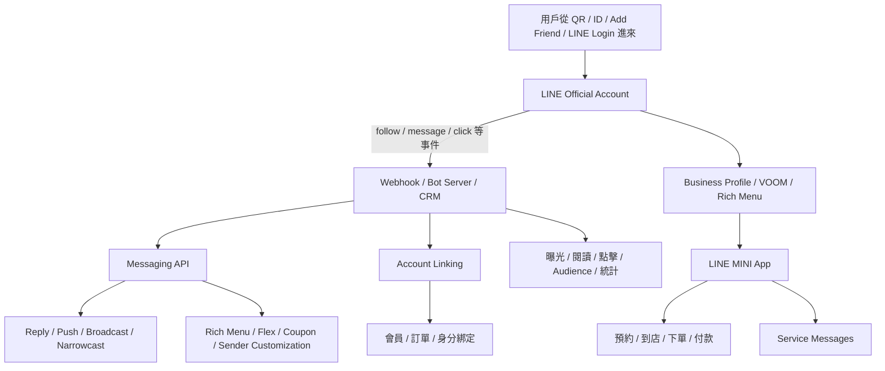
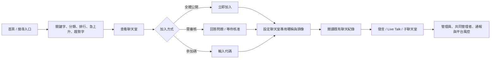
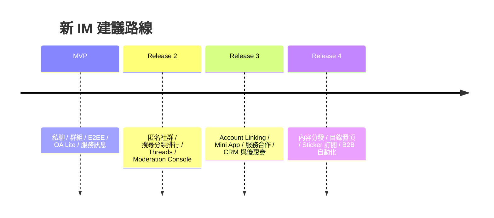

# LINE 作為公共 IM、社群與內容分發產品的設計研究

## 執行摘要

我對 LINE 的核心判斷是：在日本、台灣、泰國三個市場，LINE 的產品重心是**以即時通訊為帳號、通知與關係底座，再向上疊加公共分發、社群互動與生活服務的 life portal**。官方在台灣與泰國官網都直接把 LINE 描述為超越通訊軟體的生活平台；日本版應用商店描述則強調，LINE 可以讓人同時連到人、資訊、服務、企業與品牌。citeturn43view2turn44view1turn43view3

這個定位，讓 LINE 與 WhatsApp、Telegram 的差異非常結構性。WhatsApp 的核心是**私密、電話號碼導向的人際通訊**：個人訊息與通話預設端到端加密，近年的內容與商業分發集中在 Updates 分頁，Meta 也明確強調廣告與頻道訂閱不會干擾個人聊天。Telegram 的核心則是**雲端訊息 + 公開頻道/群組/機器人 + 開放式平台**：私聊預設並非全面 E2EE，公開內容與機器人、Mini Apps、全域搜尋一起形成高擴散性的公共網路。LINE 走的是第三條路：把 IM、官方帳號、OpenChat、內容分頁、服務履約、Mini App 與公共服務綁在同一個入口。citeturn47search0turn47search2turn20view1turn20view3turn23search0turn19search0turn19search2

從經濟引擎看，LINE 的核心商業模組不是單一廣告位，而是**官方帳號 + 訊息分發 + 貼圖/會員 + 服務層**。entity["company","LY Corporation","japan internet company"]在 FY2023 年度報告中披露：LINE Official Account 佔 account advertising revenue 超過 80%，相關營收達 1,052 億日圓，付費官方帳號年增 39.3% 至 38.6 萬個。這代表 LINE 的 B 端經濟本質，更接近「CRM / 會員 / 促銷 / 服務入口」的複合式基礎設施，而不是單純的聊天機器人平台。citeturn36view0turn39view0

OpenChat 則補上了 LINE 原本在「非熟人、興趣導向、公共討論」上的缺口。它的設計關鍵不是把私聊群組做大，而是把**公共社群身份**從真實 LINE 身份中拆開：用戶可以在每個聊天室設不同暱稱與頭像，透過關鍵字、分類、排行、急上升與趨勢字發現房間，再由管理員、共同管理者、平台監控與舉報機制維持秩序。這個設計，使 LINE 在日本與泰國同時擁有關係通訊與公共社群兩層網路效應。citeturn46search0turn9search0turn10search0turn12search1

對一個新的亞洲市場 IM 產品來說，最值得學的是 LINE 的**分層架構**，最不值得複製的是它的**過度本地化重資產 super app 節奏**。你應該優先做成三條清楚的產品線：私密 IM、匿名公共社群、品牌與服務履約通道；並且把隱私承諾、內容治理、商業分發明確分區。若把這三層混成一個 feed 或一個 inbox，你會同時失去安全性、可發現性與商業效率。這份報告最後會把這個判斷拆成可直接寫進 PRD 的功能、API、預設值、KPI 與四階段 roadmap。citeturn19search0turn10search0turn35view0turn33view3turn47search2turn20view1

## LINE 的核心定位

如果把 LINE 定義成「聊天 app」，會低估它；如果把它定義成「社群 app」，也會誤判。就產品結構而言，LINE 在日本、台灣、泰國的真正重心是：**以私聊維持高 DAU 與高通知打開率，以官方帳號與內容頁面提供公共分發，以 Mini App、服務履約、電商與公共服務完成服務履約與留存**。台灣官方站點直接寫出「超越通訊軟體，成為生活中不可或缺的平台」；泰國站點則寫成「除了溝通傳訊，還打造讓每日生活更簡單的服務體驗」；日本版 app 描述則說 LINE 可以「無縫連到人、資訊、服務、企業與品牌」，FY2024 報告更把 LINE 改版目標寫成導向 MINI Apps、電商與 AI agent 的入口優化。citeturn43view2turn44view1turn43view3turn40view0turn42view0

| 產品 | 核心工作 | 隱私模型 | 商業模式 | 生態系 | 發現與分發 |
|---|---|---|---|---|---|
| LINE | IM 底座上的 life portal | Letter Sealing 預設保護文字、位置、圖片/影片/語音、檔案與 1:1 通話；群組通話、Meeting、相簿、記事本不在同一層級。OpenChat 另有 24/7 監控與公開空間規則。 | 官方帳號固定費 + 訊息量計費、帳號廣告、貼圖、會員、服務履約/電商/高敏服務 | 官方帳號、Messaging API、帳號綁定、LINE MINI App、服務與內容頁面形成閉環 | OA 透過 QR、ID、按鈕、LINE Login 導流；OpenChat 透過搜尋、分類、排行、急上升、趨勢字；內容透過 Home/News/TODAY/VOOM/Service 等頁籤分發。 citeturn19search0turn19search2turn10search0turn36view0turn39view0turn35view1turn9search0turn33view3 |
| WhatsApp | 私密人際通訊 + 輕量官方群組/頻道 | 個人訊息與通話採 E2EE；Meta 強調個人聊天不會用於廣告。Channels/Status 集中在 Updates 分頁，與私聊分開。 | 付費商業訊息、點擊發訊廣告，近年新增 Updates 分頁的頻道訂閱、Promoted Channels、Status Ads | Business App / Business Platform、Catalog、Interactive Messages、Communities | 社群以既有群組整合為主；可建立 community，最多納入 100 groups；內容發現集中在 Channels directory 與 recommendations。 citeturn47search0turn47search1turn47search2turn47search3turn47search5turn47search12turn47search25turn22search3 |
| Telegram | 公開分發網路 + 雲端訊息 + bot/platform | 預設 Cloud Chats 為 client-server / server-client encryption；Secret Chats 才是 device-specific E2EE；Telegram 明說為了可跨裝置與備份，沒有把所有聊天做成 secret chats | Premium、Telegram Ads、公頻道廣告 50% 分潤、Mini Apps/機器人生態 | public username、groups/channels、bots、Mini Apps、開發者 API | 可用 username 做 Global Search；公開頻道、群組與機器人天然可被找、可被鏈接。citeturn20view1turn20view3turn23search0turn23search7 |

這張表背後的設計含義很重要。WhatsApp 的主要任務是把個人訊息做到極簡、可信、全球通用，所以它把公共內容與商業貨幣化壓到 Updates 分頁；Telegram 的主要任務是把公開群組、頻道、機器人與開發者平台做成一個可搜尋、可鏈接、可分發的公共網路，所以它犧牲了「所有私聊都強預設 E2EE」的簡潔敘事；LINE 的主要任務則是把高頻通訊轉成生活入口，所以它會同時長出官方帳號、貼圖、OpenChat、News/TODAY、Service、服務與 Mini App。citeturn47search2turn20view1turn43view2turn43view3turn40view0

因此，對公共 IM + 社群 + 內容分發產品而言，LINE 的真正定位應該被理解成：**關係型 IM 提供流量與通知、公共模組提供發現與內容、服務履約模組提供留存與 ARPU**。這個結構，比把 LINE 視為「有很多附加功能的 Messenger」更接近事實。citeturn43view2turn43view3turn36view0turn40view0

## 核心模組拆解

### Official Accounts

LINE Official Account 的價值，不在於「品牌也能發訊息」這件事；真正的價值在於它把**獲客、互動、CRM、服務入口、內容分發**壓進同一個容器裡。從 acquisition 端，品牌可以用 QR code、LINE ID、Add Friend button、LINE Login 引導加好友；從 interaction 端，LINE Platform 會把 follow、message 等事件用 webhook 送到 bot server，品牌可用 Messaging API 做 reply、push、broadcast、narrowcast、rich menu、quick reply、Flex Message、coupon 等互動；從 CRM 端，帳號綁定能把 LINE 帳號連到商家的會員帳號，讓「聊天 = 會員識別 + 訂單/通知入口」；再往下則可接 LINE MINI App 與服務履約。citeturn35view1turn34search14turn34search13turn33view0turn33view2turn35view0turn33view3

架構上，LINE 很有意識地把**「行銷訊息」與「服務訊息」**切開。LINE MINI App 的 service message 只允許作為某個用戶動作的確認或回應，例如預約完成、前一天提醒；折扣、優惠券、新商品、活動宣傳都被明文禁止。這很關鍵，因為它讓用戶把官方帳號與 Mini App 的一部分訊息理解為「服務履約/服務基礎設施」，而不是每則都是廣告。citeturn33view1

LINE 也把 segmentation 與 measurement 內建到官方帳號基礎設施裡。開發者文件顯示，官方帳號可以建立「點擊 audience」「已讀 audience」，並在 JP/TW/TH 三地建立進階 audiences；同時也能抓 narrowcast / broadcast 的 user interaction statistics。這代表 LINE 官方帳號的實際形態更接近**聊天式 CRM/CDP**，而不是單純 broadcast channel。citeturn33view0turn25search10

從 monetization 看，官方帳號是 LINE 最硬的商業引擎之一。FY2023 報告寫得很直接：LINE Official Account 佔 account advertising revenue 超過 80%，相關營收 1,052 億日圓，2023 年 6 月調價後，付費官方帳號數年增 39.3% 至 38.6 萬；公司還把它定義為兼具 CRM 與 sales promotion tool 的 stock-type business，收入結構是**固定費 + 按量計費**。這是非常成熟的 B2B SaaS + messaging monetization 結構。citeturn36view0turn39view0

品牌為什麼願意用？因為在 LINE 裡，官方帳號是觸達、對話與轉換的一體化入口。LY 報告把它定義成可以建立 one-to-one communication 的高觸達工具；在泰國案例中，社會保險辦公室用 LINE Official Account 做通知與窗口服務，詢問量下降超過 20 萬件；KritShop 上線 OA 後，結合 LINE Ads 與 CRM 積分機制，銷售增加 50%、客群成長 3 倍；Madame Fin 的粉絲數成長 5 倍、來自 LINE 廣告客戶的銷售增長 126%。台灣的 LINE TODAY 也把內容分到多個專屬官方帳號上，總好友數超過 2,800 萬。citeturn38view0turn31view1turn31view0turn31view2

對用戶來說，官方帳號的價值不是「接收品牌推播」而已。日本與台灣 app 描述都把它放在「拿到最新資訊、優惠券、生活服務接點」的脈絡下；一旦官方帳號接上帳號綁定、Mini App、服務履約或預約，它就變成可持續使用的服務通道。這是 LINE 和很多「品牌 bot」平台最大差異。citeturn43view3turn44view0turn35view0turn33view3

### OpenChat / Groups

OpenChat 的設計本質，是解決「通訊錄式 IM 無法承接非熟人、興趣導向、弱關係討論」的結構問題。LINE 在 2019 年推出 OpenChat 時就很明確：它是針對 hobbies、interests、lifestyles 的 enhanced group functionality，支持每個聊天室用不同 profile、管理員制度、三種加入方式、可回看一定期間歷史、群規模可到 5,000 人。citeturn46search0

之後的日本官方使用指南，把 OpenChat 補成了更完整的 public community product：用戶可以靠關鍵字搜尋、分類搜尋、排行、急上升、趨勢關鍵字找房；房主可管理公開、審核加入、參加碼三種入口；聊天室可有子聊天室、Live Talk，且共同管理者最多 100 名。citeturn9search0

安全與治理機制同樣是 OpenChat 的設計核心。官方安全指引寫出 24/7 監控、禁止交換個資/LINE ID、限制未成年人不健全邀約、禁止誹謗、迷惑行為、詐騙、宗教/傳銷招攬與危險內容，且違規可能延伸到整個 LINE app 的停用。2019 的發布稿也寫到：OpenChat 內容會在用戶同意後接受監控、未成年人或未做年齡驗證者有功能限制。這說明 OpenChat 根本不是「只是把群組做大」；它是**帶有平台治理權的公共聊天室網路**。citeturn10search0turn46search0

與 Telegram、Discord 相比，OpenChat 的差異非常鮮明：

| 維度 | LINE OpenChat | Telegram | Discord |
|---|---|---|---|
| 發現機制 | App 內搜尋、分類、排行、急上升、趨勢字，發現偏「主題/趨勢導向」 citeturn9search0 | username + Global Search + public groups/channels/bots，發現偏「公開網路導向」 citeturn20view1 | Server Discovery 與社群活動入口，發現偏「伺服器/社群導向」 citeturn23search3turn23search21 |
| 身份模型 | 每個聊天室可設不同暱稱/頭像，與主 LINE profile 分離；弱實名、強房間身份 citeturn46search0turn9search0 | 可用 public username、共同群組接觸；身份更接近帳號級公開別名 citeturn20view1 | 身份以 server/role 為中心，通常不是聊天室級身份重設；更偏社群成員制度 citeturn23search2turn23search5 |
| 結構粒度 | 主聊天室 + 子聊天室 + Live Talk，貼近即時群聊演化 citeturn9search0 | groups/channels/bots/Mini Apps，偏分發與工具化 citeturn20view1turn23search0 | servers/channels/threads，threading 與社群治理較成熟 citeturn23search2 |
| 治理方式 | 管理員 + 共同管理者 + 舉報 + 平台 24/7 監控 + 年齡/個資規範 citeturn10search0turn46search0 | Telegram 會對非法 public content 做法律審查與下架；治理較偏公開內容執法 citeturn20view1 | 社群主自治 + AutoMod + 關鍵字/垃圾訊息/惡意連結過濾 citeturn24search0turn24search1turn24search4 |

產品上最重要的洞見是：OpenChat 並沒有把 LINE 變成 Twitter/X 或 Reddit；它把 LINE 變成**可承接公共興趣社群的 IM**。這很適合日本、台灣、泰國，因為這三地用戶本來就把 LINE 當高頻生活基礎設施，用同一個 app 同時做熟人通訊與主題社群，心理成本遠低於下載另一個社群 app。泰國 2025 年官方故事甚至提到，OpenChat 在泰國已有約 2,000 萬 MAU，相當於每三位泰國人就有一位在使用，而且很多年輕人查資訊時會先打開 OpenChat。citeturn12search1turn11search0

### 貼圖與輕互動

LINE 貼圖的重要性，常被外部觀察者低估成「亞洲人喜歡可愛貼圖」。這個理解太淺。從產品設計看，貼圖是**低認知成本、高情緒密度、可商業化、可品牌化**的互動原語。日本與台灣 app 描述都把 stickers/emoji/themes 放在核心功能區，強調它們能讓聊天更有趣、更能表達自己；LYP Premium 與台灣 LINE Premium 也把「1,500 萬種以上目標貼圖用到飽」當作核心會員利益。citeturn43view3turn44view0turn15search10

貼圖也不是裝飾性營收，而是 LINE 早期最強的商業驗證之一。2015 年官方公布 Creators Market 首年數據：創作者貼圖總銷售 89.4 億日圓、超過 39 萬名註冊創作者、上架超過 10 萬組貼圖，前 10 名創作者平均收入破 1 億日圓。更早的資料顯示，創作者可拿到約 50% 收入分成。這個模型證明了貼圖是 UGC 內容市場，也是高度情緒化的數位商品。citeturn13search0turn13search18

後續，貼圖又演化成**訂閱商品**與**B2B 增長工具**。官方公告顯示，LINE Stickers Premium 在 2022 年已提供超過 1,000 萬個貼圖；2025 年的 LYP Premium 特典已寫到 1,500 萬種類以上。FY2023 媒體事業報告還把 LINE Promotion Sticker 視為 account ads 的重要產品，因為它可作為增加官方帳號好友數的 incentive。換言之，貼圖在 LINE 裡同時扮演了：表達、留存、付費會員、品牌增粉。citeturn15search0turn15search10turn38view0

品牌面也有明顯案例。泰國 luxury brands 透過買家限定貼圖與主題建立 exclusivity；這些貼圖並不只是「贈品」，而是對品牌身份的延伸。這個做法很適合高頻聊天介面，因為它把品牌從 banner 廣告搬進了用戶的日常互動。citeturn31view0turn31view1

輕互動的另一個關鍵，是推薦系統。台灣 iThome 引述 LINE 團隊的聯邦學習案例時提到，LINE 在貼圖訂閱帳號導入高度個人化推薦後，下載量提高了 5%。這說明貼圖不是靜態目錄商品，它的價值來自**在對的時刻，讓用戶快速找到可發送的表意單位**。citeturn28search5

對新的 IM 產品來說，這裡真正值得學的不是「做貼圖商店」，而是定義一套**可購買、可推薦、可品牌化、可作為 social object 被分享**的輕互動層。GIF、reaction、emoji pack、short voice stamp 都可以是實作形式；關鍵在於它必須同時服務 engagement 與 monetization。

### 生活服務入口

LINE 之所以變重，不是因為功能貪多，而是因為它刻意把高頻通訊轉成生活入口。台灣與泰國官網都把這件事說得非常直接；LY 的全球業務頁面則把台灣定義為「life platform」、泰國定義為「complete digital life ecosystem」。FY2024 報告更寫得明白：LINE app 改版的目的，是優化前往 MINI Apps 與電商服務的導航，用 Shopping tab 與 Service tab 擴大服務履約與廣告收入，並讓 AI agent 支援日常生活的多種場景。citeturn43view2turn44view1turn40view0turn42view0

底層整合模型有三層。第一層是**LINE MINI App**：它本質是運行於 LINE 內的 web application，讓服務不需要另裝 native app；官方文件寫到使用者可從 LINE 內外進入，2025 年時平台服務數已超過 20,000、MAU 超過 1,400 萬。第二層是**Service Messages**：作為預約、訂單、提醒等服務履約性通知。第三層是**服務與會員綁定**：讓官方帳號與 Mini App 不是孤立的內容入口，而是具服務閉環的服務通道。citeturn33view3turn33view1turn40view0

官方公開案例能看出這個策略如何落地。LINE DAY 2020 與 DEV DAY 2020 先後披露：LINE 曾用官方帳號支援疫情諮詢與學校方案；Shibuya Ward 住民票申請可在 LINE 上用 eKYC 與 LINE Service 完成；Tokyo Gas 與 LINE 合作讓用戶在 app 內接收水電瓦斯帳單並服務履約；LINE Doctor 讓搜尋診所、預約、視訊看診與服務履約發生在同一個 app；企業端則把 OA 與 LINE Service、預約、語音/視訊客服串起來。citeturn30search0turn30search1

這種「變重」在日本、台灣、泰國都各自找到本地模式。台灣有 LINE TODAY、LINE Service、LINE Service、LINE GO、GIFTSHOP，且 LINE TODAY 單一服務就有 1,800 萬用戶、約占台灣 78% 人口；泰國則有 LINE TODAY、LINE OpenChat、LINE MAN、LINE BK、LINE Official Account。從 platform effects 看，LINE 用的是一個非常亞洲化、也非常務實的飛輪：**IM 的高頻打開 → 官方帳號/內容導流 → Mini App / 服務履約 / 預約 → 服務與通知回流到聊天 → 更高留存與更高 B 端價值**。citeturn31view2turn43view2turn12search9

這裡最該注意的產品真相是：LINE 變重以後，並沒有失去 IM 身分；它把 IM 變成**服務與服務履約的壓艙石**。這和很多超級 app 直接在首頁塞滿功能不同。LINE 的做法更像是：先用聊天與通知建立 habitual open，再把生活場景逐步吸入。

## 成功因素

LINE 在亞洲成功，核心不是單一功能領先，而是它同時疊出了四種網路效應：**私聊關係圖、品牌訂閱圖、興趣社群圖、服務圖**。只要四層裡有兩層以上在同一個市場形成閉環，LINE 就很難被純 IM 或純社群產品取代。這一點在日本、台灣、泰國都成立，只是主力模組不同。citeturn43view2turn36view0turn31view2turn12search1

| 市場 | 關鍵成功因素 | 主要產品抓手 | 證據 |
|---|---|---|---|
| 日本 | 起源於 2011 災後的 communication infrastructure 敘事，先占住熟人通訊，再把新聞、官方帳號、服務履約、公共服務疊上去；日本版 app 仍有 1 億國內 MAU。 | 私聊、官方帳號、LINE NEWS、Service、MINI App、政府/市政服務 | LINE 官方稱產品誕生於震災之後、目標是 dependable communication infrastructure；日本版 app 商店稱國內 1 億用戶；疫情/自治體/帳單/醫療等案例顯示它已進入社會基礎設施層。 citeturn45search0turn43view3turn30search0turn30search1 |
| 台灣 | 極高滲透率 + 內容分發與生活服務做深。LINE 在台灣已不是單功能 app，而是日常資訊、服務與品牌互動的主入口。 | LINE TODAY、LINE Service、LINE Service、官方帳號、Fact Checker | LY 官方寫明台灣超過 90% 人口使用 LINE；Google Play 寫台灣有 2,200 萬人用 LINE；LINE TODAY 有 1,800 萬用戶、超過 600 家媒體夥伴、相關 OA 總好友超過 2,800 萬。 citeturn43view2turn44view0turn31view2 |
| 泰國 | 高滲透率 + 強本地夥伴 + OpenChat 與官方帳號都做大，讓 LINE 同時抓住年輕社群與企業/政府服務。 | OpenChat、Official Account、LINE MAN、LINE BK、TODAY | LY 官方頁面提供 5,400 萬 MAU、81.7% 滲透率；官方故事指出 OpenChat 約 2,000 萬 MAU；政府機關與外部機構大量使用 OA，SSO 甚至減少 20 萬件詢問。 citeturn43view0turn12search1turn11search0turn31view1 |

日本的勝法，來自**社會基礎設施化**。災後通訊場景給了 LINE 一個比「免費訊息 app」更強的心智位置。之後，LINE 並沒有只追求社交娛樂，而是把官方帳號、新聞、政府合作、醫療、帳單、服務履約和 Service 一路做進來。這讓 LINE 在日本的護城河形態，很像手機上的準公共入口。citeturn45search0turn30search0turn30search1turn43view3

台灣的勝法，來自**高滲透通訊 + 高頻內容 + 生活服務**的結合。很多 IM 可以做到高滲透，卻做不出 1,800 萬用戶級的內容產品，也做不出足夠深的品牌與服務履約整合。LINE TODAY 在台灣同時提供新聞、影音、直播、互動投票與事實查核，加上 LINE Service / LINE Service，讓 LINE 不只是溝通入口，也是生活資訊與服務履約習慣入口。citeturn31view2turn43view2turn44view0

泰國的勝法，則是**本地化最完整**。LINE 在泰國不只是一個 imported messenger，而是把本地生活服務、外部機構、官方帳號、OpenChat 都做成了可規模化的網路。對企業與政府而言，LINE 的價值在於「民眾本來就在這裡」；對年輕用戶而言，OpenChat 讓 LINE 不是只有 family/work 群，也能承接 fandom、學校、興趣與資訊交換。citeturn43view0turn12search1turn31view1turn12search9

另一個常被漏看的因素，是**地方制度與夥伴綁定**。泰國有 LINE BK 與 LINE MAN，台灣有 LINE Service Taiwan 與 LINE Service，entity["company","Yahoo! JAPAN","japan internet portal"]整合後又強化了日本的電商、會員與廣告飛輪。這種與本地外部機構、媒體、零售、公共機關的綁定，決定了 LINE 的成功不是 abstract product win，而是**產品 + 地方商業系統的共同勝利**。citeturn43view2turn12search9turn18search0turn40view0

## 問題與極限

LINE 沒有成為全球公共社交平台，原因不在「產品不夠多」，反而在於它的強項高度依賴地區性密度。官方資料已經顯示，LY 把海外重點明確放在台灣、泰國等幾個高滲透市場；MINI App、官方帳號 audience、服務履約、政府服務這些高價值模組，本質上都需要地方商家、地方法規、地方服務履約、地方內容夥伴密度。這種護城河很深，跨國可移植性卻沒有那麼高。citeturn43view0turn33view0turn33view3turn40view0

第二個限制是**隱私敘事不夠單純**。LINE 在 private chat 上有 Letter Sealing，這是真正的優勢；問題在於它的保護範圍對一般用戶並不直觀：群組通話、Meeting、相簿、記事本並不在同一層級，OpenChat 又是接受平台監控與公共規範的空間。相較之下，WhatsApp 的消費者敘事非常簡潔：個人訊息與通話 E2EE，新的商業化集中在 Updates，不碰個人聊天。對全球市場來說，這種簡潔敘事更容易擴散。citeturn19search0turn19search2turn10search0turn47search0turn47search2

第三個限制是**全球心智位被競品先佔位**。早在 2012 到 2014 年，Reuters 對 LINE 的報導就把它放在與 WhatsApp、Viber 等全球 land grab 的競爭語境中；WhatsApp 之後鞏固了全球電話簿式私聊的主導地位，Telegram 則建立了公開頻道、公開群組、bots 與 username 的跨國公共網路。LINE 雖然曾積極追求全球成長，產品後續的高價值模組卻越來越偏向日本、台灣、泰國本地生活場景，全球統一擴張的產品敘事反而變弱。citeturn45search2turn27search3turn27search7turn20view1turn47search2

第四個限制是**平台開放性沒有走到 Telegram 那麼極端，也沒有像 Discord 一樣把 operator tooling 做成世界級社群作業系統**。LINE 的 Developers 文件很成熟，官方帳號、Mini App、帳號綁定、coupon、audience 都很完整；問題是這些能力仍然深綁 LINE app 與在地商業鏈。Telegram 的 username、bots、Mini Apps 天生是 internet-native；Discord 的 server、channel、thread、AutoMod 與社群權限模型則更適合重社群運營。LINE 的 openness 更偏「可商業化的平台能力」，全球開發者可移植性沒有那麼強。citeturn35view0turn33view2turn33view3turn23search0turn20view1turn23search2turn24search1

第五個限制是**信任與治理事件傷害了它最珍貴的資產**。2021 年 LINE 因中國工程師可接觸日本用戶資料而遭日本政府調查，政府一度暫停將敏感資訊交由 LINE 處理；2023 年又發生經由 Naver cloud system 的未授權存取，影響超過 30 萬筆資料，並引發日本政府要求檢討外包與資本控制關係。對一個把官方帳號、市政、醫療、服務履約都做進來的平台來說，這類事件不是公關噪音，而是直接挑戰基礎信任。citeturn27search0turn27search11turn27news39

基於前述證據，我的反事實推論有三點。第一，**若 LINE 當年優先把公開頻道、bot 與開放身份做成全球化產品，理論上有機會在某些市場吃到 Telegram 的公共分發盤**；代價則會是更高的濫用、法規與安全壓力。第二，**若 LINE 當年把自己鎖在 IM + 貼圖，不往官方帳號、服務與 Mini App 深挖，它在全球擴張敘事上可能更輕，但在日本、台灣、泰國的 ARPU、B 端價值與護城河會明顯更弱**。第三，**若 LINE 對所有表層都用單一隱私承諾，產品訊息會更乾淨；但公共社群與公共服務必然需要不同治理與可視性，完全同構化其實不現實**。以上三點屬於基於已公開產品結構與市場結果的推論，而非公司明示策略。citeturn19search0turn10search0turn36view0turn40view0turn20view1turn47search2

## 可借鏡與該避免

| Module | Recommendation (Emulate / Avoid / Modify) | Rationale |
|---|---|---|
| Official Accounts | Emulate | 這是 LINE 最成熟、最可複製的 B2B 引擎：獲客、訊息、CRM、優惠券、帳號綁定、Mini App、服務通知都能疊在同一容器裡，而且已被證明可形成固定費 + 量計費的穩定營收模型。citeturn36view0turn39view0turn35view0turn33view2 |
| OpenChat | Modify | 應該學「聊天室級匿名身份 + 發現機制 + 強治理」，但不要直接照搬。若你的新產品一開始沒有 LINE 那種全民 IM 頻率，社群與私聊應更清楚分層，避免讓公開聊天室污染私聊安全感。citeturn46search0turn9search0turn10search0 |
| Stickers | Emulate | 貼圖是表達層、會員層、品牌層、成長層的共用原語。這個模組的普適性高，而且商業化彈性大。citeturn13search0turn13search18turn38view0 |
| Service Layer | Modify | 服務履約很有價值，卻不應在產品初期重資產自建。更好的路徑是先把服務訊息、會員識別、Mini App 與 PSP/外部機構合作做起來，等商家密度與用戶行為成立後再加深。citeturn33view1turn30search1turn43view2 |
| Discovery | Modify | LINE 值得學的是把 discovery 做成多層：社群靠 search/category/rank，品牌靠 OA friend graph，內容靠 tabs。新產品應避免只押單一 feed。citeturn9search0turn35view1turn31view2turn42view0 |
| Privacy model | Modify | 私聊與公共社群一定要分開承諾。建議比 LINE 更徹底：所有 private 1:1 / group chat 與 calls 全面 E2EE；公共社群則明確標示為 moderated public spaces，避免曖昧。citeturn19search0turn10search0turn47search0 |
| Monetization | Modify | LINE 的多元變現是優勢，但對新產品來說應分階段做：先 SaaS/訊息、再服務履約、最後才做內容廣告。不要過早把廣告塞進私聊主介面。citeturn36view0turn47search2turn20view3 |
| Platform openness | Modify | 學 LINE 的 API 深度，學 Telegram 的可鏈接性，學 Discord 的 operator tooling。不要只做封閉品牌平台，也不要一開始就走過度開放的 bot jungle。citeturn35view0turn33view3turn23search0turn24search1 |

核心原則可以壓縮成一句話：**學 LINE 的分層與商業效率，補強它在全球可移植性、私密/公共邊界與平台開放性的不足。**

## 新 IM 的具體產品含義

以下我不寫抽象原則，直接寫可下 PRD 的規格方向。總體架構建議是三條線平行運作：**Private（私聊與群組） / Public（匿名社群與內容發現） / Service（官方通道與服務通知）**。三條線共用帳號與通知能力，資料、權限、隱私承諾分開。

| 區塊 | PRD-ready 設計規格 |
|---|---|
| 帳號與身份 | 手機號 + 裝置綁定 + passkey 為主；建立兩套 profile：`private profile` 供私聊/熟人群組使用，`public alias profile` 供社群使用。Public alias 在第一個社群加入時才要求建立，降低註冊阻力。 |
| 私聊與群組 | `1:1 chat`、`small group`、`large group` 三種房型；1:1 與所有熟人群組預設 E2EE；群組支援 polls、events、pinned notes、shared album；預設禁止陌生人透過共用社群直接 DM。只有 mutual follow、對方回覆、或管理員核准後才能開 DM。 |
| 官方通道 | 官方帳號最少要有：business profile、QR/連結加好友、welcome flow、quick reply、rich menu、broadcast、segmented campaign、transactional message lane、客服接待台、member binding。品牌不准用員工私人帳號服務客戶，必須走官方通道。 |
| API 行為 | Webhook 至少輸出：`follow`, `unfollow`, `message`, `postback`, `menu_click`, `coupon_view`, `coupon_redeem`, `account_link_success`, `reservation_created`, `service_event_success`, `community_join`, `community_leave`, `report_submitted`。Campaign API 與 Transactional API 分端點，避免濫用。 |
| Onboarding flow | 第一步只完成登入與聯絡人導入；第二步引導建立第一個私群；第三步只推薦 3 類高 utility 的官方帳號，例如物流、外部機構、地方生活資訊；第四步才讓用戶選興趣標籤進入 Public 目錄。不要在 cold start 逼用戶先追內容。 |
| 社群發現 | Public 目錄至少有：關鍵字搜尋、分類、排行榜、急上升、地區/校園/興趣標籤、最近活躍、官方精選。加入方式至少有三種：公開加入、問答審核、邀請碼。新手加入後可預覽有限歷史訊息與群規摘要。 |
| 社群結構 | 採 `Community > Room > Thread/Side-room` 三層。主房間承接大流量即時對話；thread/side-room 承接子題、FAQ、地區分房、買賣等。比 LINE 更應該強化 thread，因為這決定你是否能承接 knowledge community，而不只是 chat room。 |
| Moderation tools | 平台層必須有 24/7 ML + rule-based 風控；社群層必須有 owner、admin、mod、helper 四級權限。工具至少包含：關鍵字/regex 過濾、惡意連結攔截、電話/LINE ID/IG handle 自動遮罩、spam/raid 限流、未成年保護規則、申訴隊列、審核日誌、違規回放。 |
| 隱私與資料預設 | Private 區完全 E2EE；Public 區明示為 moderated public space，伺服器可見 content 用於安全治理。**最重要的是不要混淆這兩套承諾。** Targeting 僅能基於官方通道互動、服務履約行為、頁面點擊與用戶明示選擇；嚴禁用 private message 內容做廣告定向。 |
| 服務履約與 Mini App | Mini App 先做 web container；只允許三類高頻場景進入首批白名單：會員券/點數、預約/排隊、訂單/物流。Service message 規則比 LINE 更嚴：只有用戶行為後的確認、提醒、異常通知可進服務訊息通道；所有優惠資訊都必須走 campaign lane。 |
| 輕互動 | 建立可購買的 `expression layer`：sticker packs、emoji packs、brand packs、seasonal packs、reaction bundles。要有 `compose-time suggestion`，根據對話語境與用戶習慣推薦；同時開放品牌贈送 pack 作為拉新激勵。 |
| Monetization mechanics | 第一階段靠官方通道訂閱與超額訊息費；第二階段加服務履約抽成與 Mini App SaaS；第三階段才開 Public 目錄的 promoted placement 與內容廣告。**私聊列表與 private inbox 永不放廣告。** |
| Metrics to track | Private：DAU、sender rate、reply latency、7 日 retained pairs、group weekly active ratio。Public：join-to-read rate、join-to-post rate、7 日發言率、mod action rate、舉報成立率、惡意內容攔截率。Service：add-friend conversion、account-link completion、reservation completion、service volume/MAU、transactional opt-in rate。 |
| Suggested KPI | `D30 retained senders ≥ 35%`；`Public join → 7D post ≥ 20%`；`OA add friend → account link ≥ 25%`；`service message open rate ≥ 70%`；`abuse reports resolved < 24h`；`spam account 24h suppression ≥ 95%`；`Mini App repeat 30D ≥ 30%`。 |

這裡我特別強調三個你在做新產品時很容易犯的錯。第一，**不要把 Public 社群直接疊在 private chat list 上**，否則安全感會快速下降。第二，**不要把官方通道做成聊天機器人 demo**，官方通道真正的價值在 CRM、會員、服務訊息與服務入口。第三，**不要太早做全能 super app**；當地服務履約、商家、媒體、政府、物流密度還沒出現前，重功能只會讓 app 變重，卻無法形成飛輪。

下面是我建議的四階段 roadmap：

| 階段 | 目標 | 交付內容 | KPI Gate |
|---|---|---|---|
| MVP | 把高品質私聊與官方通道骨架做穩 | 1:1 / small group、E2EE、聯絡人導入、QR 加友、OA business profile、reply / broadcast、basic analytics、transactional lane | D30 retained senders、OA add-friend rate、message delivery success |
| Release 2 | 建立 Public 社群第二曲線 | 匿名 alias profile、public directory、公開/審核/邀請碼三種加入方式、rooms + threads、mod console、report pipeline、trend ranking | join-to-post、7D community retention、report SLA、abuse suppression |
| Release 3 | 接上服務履約與服務閉環 | account linking、membership/card、reservation/order Mini App、service_event partner、service messages、coupon、segmentation、CRM dashboard | account-link completion、reservation completion、service volume/MAU、service message open rate |
| Release 4 | 把內容分發與變現做深 | promoted directory、brand sticker packs、expression subscription、creator/brand content tab、advanced targeting、merchant automation | Public DAU、sticker ARPPU、merchant retention、ad/boost ROI |

最後給一句決策結論：**如果你的目標是做公共 IM + 社群 + 內容分發，最該複製的是 LINE 的「分層」，不是它的「重量」；最該避免的是把私密溝通、公共社群、品牌行銷混成同一套產品規則。** LINE 在日本、台灣、泰國之所以成立，靠的是很清楚的產品分工，再加上強在地密度；缺少其中任何一個條件，照抄外觀都不會成功。citeturn43view2turn36view0turn12search1turn31view2turn31view1

**研究限制**：官方來源對官方帳號、Mini App、部分內容與高敏產品揭露很多，對 OpenChat 的分市場指標揭露較不平均；競品端以 WhatsApp 與 Telegram 的官方文件最完整，Discord 的商業與治理資訊較偏產品說明。這不影響本報告的結論方向，會影響的是少數模組的精細市場數值。