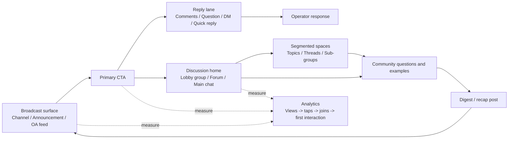
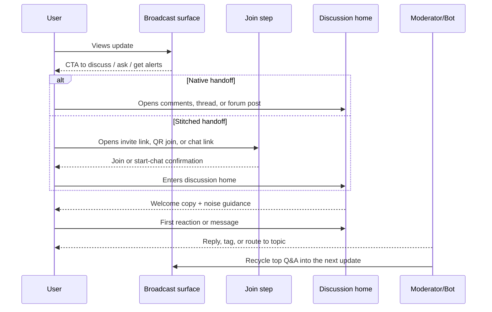

# Closed-Loop Content to Community Architecture for IM Platforms

## Executive summary

A closed loop on IM is an architecture problem more than a feature checklist. The loop works when a high-signal broadcast surface drives people into a discussion surface, the discussion surface turns passive viewers into participants, and the best questions or user-generated insights are recycled back into the next broadcast. Among the four primary platforms you asked about, Telegram and Discord are the only ones that provide a near-native version of this loop. Telegram gives you channels, linked discussion groups, per-post comment threads, invite links with join requests, granular admin rights, and channel statistics in one system. Discord gives you announcement channels, channel following, threads, forum channels, onboarding, server insights, and AutoMod inside one server architecture. WhatsApp Channels and LINE Official Account can absolutely participate in the loop, though they do it through a stitched journey: the broadcast surface is one product surface, while the conversation surface is usually a separate group, community, or one-to-one chat. citeturn42view0turn31view0turn31view1turn31view2turn31view3turn37view1turn38view0turn32view0turn32view1turn32view2turn33view0turn32view4turn32view5turn32view6turn4search5turn4search15turn5search9turn31view14turn31view16turn31view19turn34view0turn34view1

If you want one reference implementation to learn the pattern cleanly, Telegram is the strongest first build. If your community needs many parallel topics, role-based routing, and stronger structured moderation, Discord is the strongest second build. If distribution inside an already-dominant installed base matters more than native conversation design, WhatsApp and LINE deserve serious attention, though you should accept from the start that the handoff from channel to chat will need explicit UX and measurement. citeturn42view0turn31view0turn31view1turn31view2turn38view0turn32view0turn32view1turn32view2turn33view0turn32view4turn32view6turn4search5turn3search1turn3search0turn4search15turn5search9turn31view15turn31view16turn31view18turn34view1

The biggest mistaken assumption in this space is that the channel itself should also be the community home. That works poorly on WhatsApp Channels and LINE Official Account, and it becomes noisy even on platforms that technically allow it. The durable pattern is simpler: one broadcast surface, one main discussion home, one persistent CTA, and segmented discussion only after the main room has real traffic. citeturn4search5turn4search15turn31view16turn31view19turn42view0turn31view0turn31view4turn32view3turn32view4

## Platform primitives and source-backed findings

Telegram’s official primitives align unusually well with a true content-to-community loop. Channels are admin-posted broadcast spaces that send notifications with each post, support links, polls, reactions, share buttons, unique public post links, silent messages, pinned messages, and unlimited subscribers. A channel can be linked to a discussion group, which adds a comment button to each post; those comments appear as per-post threads and also land in the group for moderation continuity. Telegram also supports public usernames or private invite links with join requests, channel direct messages, topics in groups, detailed channel statistics, and granular admin rights that extend to posting, deleting, inviting, banning, topics, logs, statistics, and direct-message management. Telegram’s moderation guides also expose built-in reporting. Architecturally, this is the cleanest native “channel → comments/group → topics” stack in the set. citeturn42view0turn31view0turn31view1turn31view2turn31view3turn31view4turn37view0turn37view1turn38view0

WhatsApp Channels give you a strong low-noise broadcast surface, though they do not give you a native community home. Official docs describe channels as a way to share text, links, photos, and videos; updates can contain links with previews; followers can react, vote in polls, answer questions, and receive admin replies to question responses. Admins can report, block, or delete problematic responses, can manage channel settings and insights, and can invite additional admins. Channel sharing uses a native link and QR code. WhatsApp also states that channel notifications are muted by default, that channel history is publicly viewable for 30 days, and that followers can see updates from the prior 30 days. The missing piece is member-to-member discussion inside the channel. For actual chat, the official surfaces are separate WhatsApp groups or communities, including announcement groups and member approval flows, or one-to-one “click to chat” flows. That means WhatsApp excels at “content distribution → explicit handoff → chat,” and it performs poorly if you expect the channel itself to feel like a community. citeturn4search5turn5search0turn4search0turn4search1turn4search3turn4search6turn3search1turn3search0turn3search4turn3search9turn1search2turn30search3turn30search9turn30search12turn4search15turn4search18turn5search9

LINE Official Account is powerful as a router, service shell, and CRM-like communication layer. Official LINE docs show rich menus fixed at the bottom of the chat, quick replies, push and reply messaging through the Messaging API, targeted broadcasts, add-friend QR codes, add-friend buttons, LINE IDs, URL schemes that can open the profile, business profile, chat screen, prefilled chat message, and “share with” screens for friends or groups, along with account insights and administrator/operator roles. LINE Official Accounts can also join group chats, though only when invited by a LINE user, with the join-group setting disabled by default and only one OA allowed in a group or multi-person chat at a time. The architectural result is clear: OA is excellent for funneling users into one-to-one conversation or an invited group, and weaker as a large many-to-many community surface. One additional strategic point matters for Taiwan: LINE’s official notification message product can reach users by phone-number match even if they have not added the account as a friend, though the official docs restrict it to approved utility use and exclude advertising; the feature is limited to Japan, Thailand, and Taiwan. citeturn31view16turn34view0turn34view3turn31view15turn34view1turn31view17turn31view18turn34view2turn31view14turn31view19turn34view4

Discord is strongest when the destination is the community itself rather than a single chat thread. Official docs define announcement channels as special text channels with a Follow button; published announcement posts can be republished into following servers through webhooks, with role mentions stripped from the syndicated copy. Discord also provides public and private threads, forum channels with tags and post guidelines, onboarding with default channels and Server Guide, server-level notification controls, invite systems for community servers, Server Insights for community servers with more than 500 members, and AutoMod. Forum posts deliver a particularly useful low-noise mechanic: mentions can continue notifying followers of the specific post, while the forum channel as a whole does not ping members for every new thread. Architecturally, Discord gives you the richest toolkit for “announcement → scoped discussion → long-term segmented community,” though the join step is heavier because the user enters a full server rather than a lightweight channel follow. citeturn32view0turn32view1turn32view2turn33view1turn33view0turn32view4turn33view3turn32view8turn32view9turn32view10turn32view5turn32view6turn32view7turn32view3

Mastodon and Signal are worth studying for specific edge cases. Mastodon is structurally closer to a public social/federated distribution layer than a contained IM community home: the official docs emphasize public posting, links, mentions, hashtags, replies, notifications, featured hashtags, pinned posts, federation across servers, and admin-side announcements and moderation. It is a strong feeder and public discussion surface, and a weak owned “discussion group” equivalent. Signal, by contrast, is highly useful when privacy, trust, and small-group governance matter more than discovery. Signal’s official docs expose group links and QR codes, optional admin approval for new members, admin control over who can send messages and start calls, member/invite review, and stories shared to contacts and groups. In practice, Signal supports a private “announcement-only group + discussion group” pattern well; it does very little for public discovery. For WeChat, I would keep it on the study list if China or Chinese-traveler funnels matter. In this research run, Tencent’s OA primary docs were not reliably retrievable through the current web index, so I am flagging WeChat as a follow-up workstream rather than pretending the evidence quality matches the four primary platforms. citeturn36view0turn36view1turn36view2turn36view3turn36view4turn36view5turn36view6turn36view7turn36view8

| Platform | Broadcast strength | Native discussion strength | Native segmentation | Native redistribution | Closed-loop fit |
|---|---|---|---|---|---|
| Telegram | Very high | High | High | Medium | Best single-platform reference implementation |
| WhatsApp Channels | High | Low inside channel; medium with groups/communities | Medium | Medium | Best as acquisition surface plus separate chat home |
| LINE Official Account | High as router/service shell | Medium in 1:1; low in large public discussion | Medium with invited groups | Medium | Best as funnel/CRM shell plus invited discussion |
| Discord | High | Very high | Very high | Very high | Best for topic-rich community systems |
| Mastodon | Medium | Medium public discussion | Low as owned community | Very high | Best feeder and public discussion layer |
| Signal | Low public broadcast | High private-group discussion | Low | Low | Best for privacy-first private loops |

## Mode taxonomy

Across these platforms, five repeatable modes show up. Only two of them are truly native closed loops. The others are stitched flows that still work, provided you design them intentionally. The taxonomy below is derived from the official mechanics above. citeturn42view0turn31view0turn31view1turn31view4turn32view0turn32view1turn32view2turn33view0turn4search5turn4search15turn5search9turn31view16turn31view19turn34view0turn34view1

| Mode | How it works | Strongest examples | What it is good for | Where it fails |
|---|---|---|---|---|
| Broadcast with linked discussion home | One read-only or admin-posted feed sends people into one canonical discussion room | Telegram channel + linked discussion group; Discord announcement + one main forum/general room | Clean signal separation, easy habit formation, high clarity | Two surfaces to moderate; weak if CTA visibility is poor |
| Broadcast with reply lane | Audience replies through comments, questions, DMs, or 1:1 messages rather than public group chat | Telegram comments/direct messages; WhatsApp questions; LINE OA quick replies/1:1; Mastodon replies | Low noise, high-quality operator feedback, support and lead qualification | Weak peer bonding, weak social proof, limited many-to-many energy |
| Segmented discussion under one shell | After joining the community home, users split into topics, threads, tags, or sub-groups | Discord forums/threads; Telegram topics; WhatsApp Community + subgroups | Scale, lower noise, relevance matching | Higher onboarding complexity, more moderator overhead |
| Syndicated announcement node | One source broadcast is republished into many local spaces | Discord channel following; Mastodon federation/hashtags | Redistribution and reach | Fragmented ownership of replies and moderation |
| Group-first pseudo-channel | A group behaves like a channel because only admins post or because an announcement group is the feed layer | WhatsApp announcement group; Signal admin-only group; Telegram/Discord fallback variants | Fastest MVP where channel product is weak or absent | Feed contamination, social noise, weaker analytics, weaker discovery |

## Trade-off analysis

The table below is an analytical rating, grounded in the official platform primitives above. It focuses on the dimensions you specified: message noise, management cost, engagement feeling, and virality or redistribution. citeturn42view0turn31view0turn31view3turn32view1turn32view2turn32view3turn4search5turn4search15turn31view16turn31view18

| Mode | Message noise | Management cost | User engagement feeling | Virality / redistribution | Analytical read |
|---|---|---|---|---|---|
| Broadcast with linked discussion home | Low in content feed; medium in discussion room | Medium | High, because users can see both operator presence and peer participation | Medium to high | Best default mode when the platform supports a clear handoff |
| Broadcast with reply lane | Low | Low to medium | Medium, feels personal and responsive | Low | Best for support, expert Q&A, and lead capture |
| Segmented discussion under one shell | Low to medium when tags/topics are enforced | High at setup, medium after routines stabilize | Very high for committed users | Medium | Best once the main room is saturated |
| Syndicated announcement node | Low at source, fragmented downstream | High | Medium | Very high | Excellent reach multiplier, weaker as a single home |
| Group-first pseudo-channel | Medium at launch, high as traffic grows | Low at launch, high later | Medium to high early, then inconsistent | Low to medium | Acceptable fallback, poor long-term architecture |

A practical conclusion follows from this table. If your priority is clean learning about the loop itself, start with broadcast plus linked discussion home. If your priority is demand capture or concierge conversion, use a reply-lane model first. If your operator bandwidth is thin, resist early segmentation. Fragmenting too early makes the structure look sophisticated while reducing reply density. citeturn31view0turn31view1turn32view2turn33view0turn4search0turn34view0

## Recommended closed-loop architecture

The architecture I recommend has four layers. Layer one is the broadcast surface. Layer two is the handoff CTA. Layer three is the single discussion home. Layer four is optional segmentation once the discussion home has enough traffic to support multiple rooms. The loop closes only when content harvested from the discussion layer is deliberately recycled into future broadcast posts. This recommendation maps directly to Telegram’s linked comments and topics, Discord’s announcement-plus-forum structure, WhatsApp’s channel plus community/group or click-to-chat flow, and LINE OA’s persistent routing through menus, links, and chat entry points. citeturn42view0turn31view0turn31view1turn31view4turn32view0turn32view1turn33view0turn32view4turn4search5turn4search15turn5search9turn31view16turn31view19turn34view1

The user journey should stay explicit and boring. Hiding the handoff hurts conversion. Users need to know whether they are reading, reacting, asking, or joining. On Telegram, place the discussion inside a linked group and keep the comment button alive. On Discord, route announcements into a server that exposes only a few default channels and a single forum entrance. On WhatsApp, keep the channel low-noise and send the user into a community/group or click-to-chat path for actual conversation. On LINE, let the OA act as a router: “latest updates,” “ask a question,” and “join the chat” are enough for the first version. citeturn31view0turn31view1turn32view0turn32view4turn33view0turn4search5turn4search15turn5search9turn31view16turn31view19turn34view1

Here is the architecture decision I would standardize by platform:

| Platform | Use a channel? | Bind a group? | Recommended user journey | Main friction point |
|---|---|---|---|---|
| Telegram | Yes | Yes, natively | View post → tap comments → land in linked discussion thread/group → route to topics later | Two moderation surfaces once topics are added |
| WhatsApp | Yes, for distribution | Yes, separately via group/community or use click-to-chat | View channel update → tap invite/chat CTA → join group or start chat → welcome + mute guidance | Channel and chat are separate products |
| LINE OA | Yes, as OA feed/router | Yes, if you need many-to-many discussion | Add friend → rich menu / message CTA → enter OA chat or invited group → route by quick replies | OA itself is conversation-light at community scale |
| Discord | Yes, as announcement channel in a server | The “group” is the server forum/main channels | View announcement → join server via invite if needed → onboarding/default channels → enter forum or thread | Server join feels heavier than channel follow |

Sample CTA templates that fit this architecture:

| Use | English | Traditional Chinese |
|---|---|---|
| Broadcast CTA | **Discuss this update** → Join the chat | **討論這則更新** → 加入聊天 |
| Low-friction question CTA | **Ask a question about this update** | **針對這則更新提問** |
| Alerts CTA | **Get alerts only** | **只收重要通知** |
| Prefilled DM / OA / click-to-chat text | I came from today’s update and want to join the discussion. | 我是從今天的更新貼文過來，想加入討論。 |
| Topic routing CTA | Choose a topic: Product / Cases / Support / Off-topic | 請選擇主題：產品 / 案例 / 支援 / 閒聊 |

## UI and notification design

The structure becomes understandable when each surface answers three questions immediately: where am I, can I talk here, and how noisy will this place be. Most community structures fail because they assume users will infer that a channel is read-only, that replies go somewhere else, or that topic rooms are optional. The UI should spell this out in descriptions, pinned messages, menus, and first-run onboarding. citeturn32view4turn33view3turn42view0turn31view16

A simple naming system works better than product jargon:

| Purpose | Recommended label in English | Recommended label in Traditional Chinese | Why it works |
|---|---|---|---|
| Read-only feed | Updates | 更新 | Plain meaning, low cognitive load |
| Main community room | Lobby | 大廳 | Signals shared discussion |
| Segmented problem-solving | Topics | 主題區 | General enough for tags, threads, or rooms |
| Support lane | Ask us | 問我們 | Human, direct, clear |
| Critical notices only | Alerts | 重要通知 | Separates urgency from chatter |

Notification strategy should follow platform reality rather than wishful thinking. Telegram channels notify on each post, and Telegram lets you send silent channel messages when you want visibility without sound; pinned group messages alert everyone even if they muted ordinary group messages. WhatsApp Channels start from a safer baseline because notifications are muted by default. LINE should lean on targeted broadcasts and leave large-scale conversation to invited groups or routed one-to-one chats. Discord gives users server-wide mute controls and post-specific follow patterns in forum threads, so your job is to point them toward high-signal surfaces instead of trying to out-notify the whole server. citeturn42view0turn31view3turn1search2turn31view18turn32view8turn32view3

In practice, I would apply the following UI/UX rules.

For Telegram, pin one “Start here” post in the channel and one rules/onboarding post in the linked discussion group. Keep the discussion CTA identical on every broadcast post. Resist the temptation to add many topics too early. Telegram gives you comments, group chat, DMs to channels, and topics; users do not need all of them on day one. citeturn31view0turn31view1turn31view4turn42view0

For WhatsApp, state the split explicitly in the channel description and in the first pinned or recurring update: “Updates are read-only. Chat happens in the group.” Since channels are muted by default and public history is limited to 30 days, your best content should include a single high-clarity CTA repeated consistently. If your community is still small, a click-to-chat support path often converts better than a raw group invite because the first human response creates trust. citeturn1search2turn30search3turn3search1turn5search9

For LINE OA, make the rich menu do most of the architecture work. Three persistent actions are enough for MVP: latest updates, ask a question, join chat. After the first inbound message, respond with quick replies so users can self-route without reading instructions. Keep the menu stable for a few weeks so behavior becomes habitual. citeturn31view16turn34view0turn34view1turn34view3

For Discord, let onboarding and Server Guide hide complexity. Expose only the default channels everyone truly needs. Use one forum for structured discussion before creating many text channels. If you want members to care about specific topics, encourage them to follow particular forum posts or tags rather than keeping broad server notifications alive. The channel list should look deceptively small at first entry. citeturn32view4turn33view3turn33view0turn32view3turn32view8

A compact onboarding copy set that works across platforms:

| Surface | English | Traditional Chinese |
|---|---|---|
| Read-only feed description | This space is for updates only. Replies happen in the Lobby. | 這裡只發佈更新內容。回覆與討論請到大廳。 |
| Discussion welcome | Welcome. Start here, introduce yourself, then choose a topic if you need one. | 歡迎加入。先從這裡開始、簡單自我介紹，再依需要選擇主題。 |
| Noise guidance | Prefer low noise? Keep the Lobby muted and enable Updates only. | 想要低干擾？請將大廳設為靜音，只開啟更新通知。 |
| Topic routing | Pick one path: Product, Case studies, Support, Off-topic. | 請選一個方向：產品、案例、支援、閒聊。 |
| Moderator expectation | Read before posting. Repeated violations may lose posting access. | 發言前請先閱讀規則。重複違規可能失去發言權限。 |

## MVP recommendation

Here is the blunt version. On Telegram and Discord, build the channel layer for P1. On WhatsApp and LINE, simulate the loop with groups or one-to-one routing for P1, and treat the channel or OA as the top-of-funnel shell. Starting with a noisy all-in-one group on Telegram or Discord throws away the strongest advantage those platforms already give you. Starting with a pure channel on WhatsApp or LINE leaves you with audience reach and very little owned conversation. citeturn42view0turn31view0turn31view1turn31view4turn32view0turn32view2turn33view0turn4search5turn4search15turn5search9turn31view16turn31view19

If you need one cross-platform learning order, I would choose Telegram first, Discord second, WhatsApp third, and LINE fourth. Telegram teaches the core loop cleanly. Discord teaches structured scale. WhatsApp teaches funnel handoff discipline. LINE teaches menu- and service-driven routing, which matters a lot in East Asian messaging behavior and is especially relevant if Taiwan is in scope. citeturn42view0turn31view0turn31view2turn38view0turn32view0turn32view1turn32view2turn33view0turn32view5turn4search5turn3search1turn4search15turn5search9turn31view16turn31view15turn34view4

| Platform | P1 decision | Minimal P1 stack | Rationale |
|---|---|---|---|
| Telegram | Build the real channel | Channel + linked discussion group + one pinned welcome + one tracked invite path + optional later topics | Lowest-friction native loop, strongest stats/moderation balance |
| Discord | Build the server shell with announcement layer | Announcement channel + one forum + onboarding/default channels + AutoMod + one invite path | Best long-term structure for topic-rich communities |
| WhatsApp | Simulate with group/community | Channel for distribution + one discussion group or click-to-chat + one recurring CTA + one tracked invite/QR | Channel lacks native member-to-member chat closure |
| LINE OA | Simulate with OA router + invited conversation | OA + rich menu + add-friend QR + quick replies + one invited discussion path | OA is excellent for routing and service, weaker for large many-to-many chat |
| Signal | Group-first only | Admin-only announcement group + discussion group + QR/link join | Privacy-first pattern, weak discovery |
| Mastodon | Feeder only | Profile + hashtags + pinned posts + redirect CTA to owned community | Good redistribution, weak owned group boundary |

The minimum feature list for the first serious test is short:

- one broadcast surface
- one canonical discussion home
- one persistent CTA phrase
- one onboarding/rules artifact
- one moderation workflow
- one source attribution method for links or QR codes
- one weekly digest that feeds community output back into the broadcast layer

The success metrics should follow the loop itself rather than vanity audience size:

| Metric | Definition | Starter target for MVP |
|---|---|---|
| View to CTA tap | % of content viewers who tap the discussion CTA | 3% to 8% |
| CTA tap to join/start chat | % of CTA tappers who complete the handoff | 35% to 60% |
| Join to first interaction | % of joiners who react, vote, or post within 24 hours | 20% to 35% |
| Contributor retention | % of first-time contributors who return within 7 days | 15% to 25% |
| Community recycle rate | % of broadcast posts that reference community questions or examples | 20%+ |
| Moderator burden | Median first response time for real questions | Under 6 hours during staffed periods |

The clearest final recommendation is this: design the loop around one low-noise feed and one discussion home, then adapt the handoff to the platform. Telegram and Discord let you implement that directly. WhatsApp and LINE require a stitched handoff, so your product work shifts from “build a channel” to “make the jump from content to chat obvious, measurable, and worth it.”