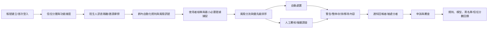
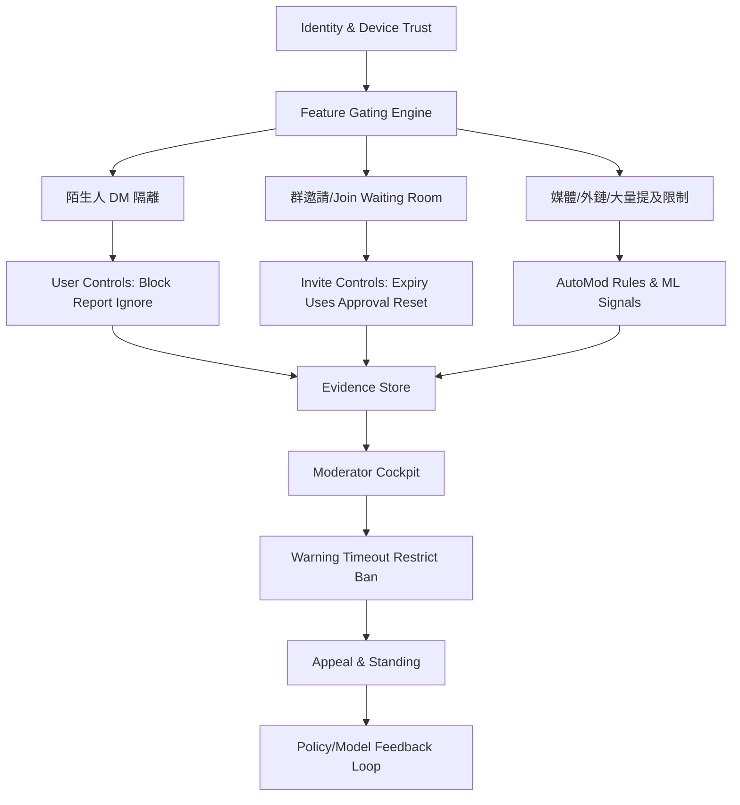

# 主要即時通訊平台反垃圾訊息、騷擾、濫用與詐騙治理研究

## 執行摘要

這份比較的核心結論很直接：**成熟的 IM 風控不是靠單一模型或單一檢舉按鈕，而是靠多層式摩擦設計**。實務上最有效的組合通常包含五層：帳號信任分層、入群/邀請摩擦、群管理控制面、使用者端自我保護、以及有證據鏈的檢舉與申訴流程。Discord 在「社群治理控制面」最成熟；WhatsApp 在「隱私優先但仍可執法」的取捨最值得學；Telegram 在「大群治理與邀請連結粒度」很強，但閾值與處置流程透明度偏低；LINE 在「非好友 ingress 控制」很有特色；而 entity["organization","Signal","messaging app"] 與 entity["company","Slack","workplace messaging"] 分別代表了「隱私極致」與「企業稽核極致」兩端的參考樣本。 citeturn14view0turn17view0turn9view1turn24search3turn34search0turn45search0turn42search2

更重要的是，**真正公開而且可產品化的精確門檻其實不多**。Discord 例外，它把新帳號門檻做成可見的 Verification Levels：驗證 Email、帳號建立超過 5 分鐘、入服超過 10 分鐘、綁定已驗證電話，這些都能由伺服器管理者直接啟用。相較之下，Telegram、WhatsApp、LINE 的很多 PM 速率、入群頻率、spam score、probation 期都沒有在官方文件中公開為固定數字，通常只公開「會被限制、會被暫時封鎖、會被封禁」這種結果，而不公開觸發閾值。這代表對攻擊者來說更難逆向，對平台營運方來說也意味著**產品透明度與誤傷可解釋性**會成為長期成本。 citeturn11view0turn9view1turn21search0turn30search3turn34search0

從設計借鑑看，最值得優先抄的不是單一 feature，而是幾個已被大型平台反覆驗證的模式：  
- **非好友訊息隔離**：Discord 的 Message Requests/Spam folder、LINE 的「未確認的 Talk Request」、Signal 的 Message Requests，都不是直接拒絕，而是先把陌生 ingress 丟到隔離層。這能大幅降低誤傷正常使用者。 citeturn20view0turn41view0turn42search0turn42search9  
- **邀請連結最小權限化**：Telegram、Discord、Signal、WhatsApp 都把連結邀請做成可重設、可失效、可限次、可轉為審批式的控制點。這是入群風險治理的第一道閘門。 citeturn8view0turn18view4turn20view3turn45search0turn28search2  
- **可操作的管理員控制面**：Discord 的 AutoMod、審核規則、audit log；Telegram 的 slow mode、partial bans、48 小時 recent actions；Slack 的 audit logs、API、anomaly events；這些都說明「moderation cockpit」本身就是產品。 citeturn12view1turn12view2turn42search2turn42search14  
- **有證據鏈的檢舉**：WhatsApp 收最多 5 則最近訊息，LINE 會送出被檢舉訊息與前後共 9 則上下文，Telegram 明示 moderator 會查看被收件者檢舉的訊息。這些都比只有「報告某人」更可執法。 citeturn24search3turn36search1turn9view2  

如果你要做一個新的 IM 平台，優先順序很清楚：**先做信任分層、陌生 ingress 隔離、邀請連結治理、原生群管控制面、完整檢舉證據鏈與申訴回路**。這五件事做不好，後面再強的模型都會被社交工程、群邀請濫用、bot 灌入與回報盲區拖垮。這個結論同時被 Discord、Telegram、WhatsApp、LINE、Signal、Slack 六種不同產品哲學所支持。 citeturn17view0turn8view0turn24search3turn41view0turn45search0turn42search2

## 橫向比較總表

下表只列**已公開、可驗證**的核心門檻與控制；對官方未公開的頻率閾值、spam score、probation 期，我明確標註為「未公開」。

| 平台 | 已公開的新帳號/訊息門檻 | 邀請/入群控制 | 群管理與審核 | 使用者保護 | 檢舉後處理與透明度 | 主要來源 |
|---|---|---|---|---|---|---|
| Telegram | 手機號碼註冊；**無公開固定新帳號 probation 數字**；若收件者檢舉經 moderator 確認，帳號可被暫時或永久限制聯絡陌生人，嚴重者封禁；為防濫用可蒐集部分 metadata，最長 12 個月；可自動封存並靜音非聯絡人新對話。 | 私密邀請連結可設**到期日、使用次數上限、需管理員審批**；可撤銷/刪除/查詢各 invite 使用者；新建群本身就有預設 invite link。 | Slow Mode；可做 partial bans；Bot API 支援管理 bot 自動處置；Recent Actions 保留最近 **48 小時**管理動作，且能看到最近 48 小時被刪除與編輯的訊息。 | 封鎖/檢舉；官方提供「誰可加我進群組/頻道」等隱私控制；可自動把非聯絡人新對話封存靜音。 | 官方明示 moderator 會檢查被檢舉訊息；也會用自動演算法分析 cloud chats 以阻止 spam/phishing；可向 @Spambot 申訴；**未公布處理 SLA 或回報通知規則**。 | citeturn8view0turn8view1turn8view2turn9view1turn7search7turn5search18 |
| Discord | Verification Levels：Low=已驗證 Email；Medium=Email 驗證超過 **5 分鐘**；High=Discord 帳號建立超過 **5 分鐘**且入服超過 **10 分鐘**；Highest=已驗證電話。Rules Screening 啟用後，新成員在接受規則前**不能發言、反應、或 DM 伺服器成員**。Message Requests/Spam folder 會隔離陌生 DM。 | Instant Invite 預設 **7 天**；最短可設 **30 分鐘**；Community server 可設不過期；可設 max uses 或 no limit；可開 temporary membership；可 **Pause Invites** 暫停所有 invite；Raid Protection 會在偵測到 join raid 後，對接下來 **1 小時**新加入者要求 CAPTCHA。 | AutoMod 可設 1 組 commonly flagged words + **最多 3 組自訂關鍵字過濾器，每組最多 1,000 個關鍵字**；擋 spam、擋使用者名稱關鍵字；timeout 寫入 audit log；伺服器 explicit image filter 可套所有成員或無角色成員；audit log 不可編輯刪除。 | 封鎖、friend request 權限、是否允許 server 成員 DM；DM spam filter 預設會先過濾非好友；對青少年預設：非好友 DM 的敏感圖片**直接 block**、好友/群 DM/伺服器則 **blur**；Teen Safety Assist 會在首次可疑 DM 出現 safety alert。 | 檢舉送出後官方會以 system DM 或 email 確認收件；高危害案件目標 **24–48 小時**、較低危害目標 **1 週內**、複雜調查可能數天到數週；混合 automated + human review；可通知是否認定違規；可在 app 內對 account action 提起 appeal。 | citeturn11view0turn12view0turn18view4turn20view3turn20view2turn12view1turn20view1turn16view1turn16view2turn17view0turn14view1 |
| WhatsApp | 手機號碼驗證註冊；**無公開固定新帳號 probation 數字**；Restricted account 表示近期行為顯示 spam/automated/bulk messaging；臨時封鎖也可能源於使用 unofficial app 或 scraping；誤封可在 app 內 Request review。 | 群組上限 **1,024**；community 成員上限 **2,000**；可 Reset group invite link；可啟用 **Approve new members**；群管理員可設定誰能新增成員；誰可加你入群可設 Everyone / My Contacts / My Contacts Except。 | 管理能力比 Discord/Telegram 窄，但官方持續加強群控：群主管理員可審批新成員、控制誰可新增成員；新成員群歷史功能可選擇分享最近 **25–100 則**訊息，且所有人都會看見透明通知；Advanced Chat Privacy 可阻擋匯出聊天、媒體自動下載、AI 功能。 | 封鎖/檢舉；Block unknown account messages 會在未知帳號訊息量過高時自動擋住；可 Silence unknown callers；suspicious links 會高亮可疑字元；可停用 link previews 以保護 IP；E2EE 代表平台平時不能讀一般訊息內容。 | 檢舉個人時會收到**最近最多 5 則訊息**，檢舉通話時也會收到最近 **5 通**通話的基本資訊；官方表示會用 machine learning 與使用者檢舉來封禁 unwanted automated messages，且會在許多 spam/scam 帳號接觸你之前就先移除；可為刑事調查保全帳號紀錄 **90 天**；一般 user/group report **未見公開統一 SLA**，只有 channel report 公開寫 typical 24h。 | citeturn25search9turn21search0turn30search2turn30search0turn24search5turn24search13turn28search2turn28search1turn28search4turn31search3turn22view9turn22view10turn31search4turn31search1turn26search2turn31search18turn24search3turn27search5turn27search9turn29search0turn27search2turn29search6 |
| LINE | **無公開固定新帳號 probation 數字**；可用 Filter messages 擋掉你不認識的人；可關閉「Allow others to add me by ID」與「Allow others to add me」來停止陌生人以 LINE ID 或電話號碼加你。 | 一般群組建立時可選 **Members join automatically**：開啟則被邀者自動加入，關閉則需接受；而且若建立時關閉，之後不能改成開啟。OpenChat 可設**參加碼**、可要求**加入審批**，且加入者需回答管理員設定問題。 | OpenChat 管理員/共同管理員可審批或刪除加入請求、可強制退會、可把 recently-left member 也列入處理；可把使用者放進禁止再加入名單，之後再手動放行；加入/退出/強制退出會產生系統訊息。 | 有獨立的「未確認 Talk Request」入口，可對非好友的對話/群邀請進行已讀、刪除、加好友、封鎖、接受、拒絕、退群；可封鎖/刪除已封鎖帳號；官方也直接提醒語音/視訊功能曾被濫用做勒索。 | 檢舉聊天訊息時會送出**被選訊息 + 前後 9 則上下文**；可同步選擇是否封鎖。官方有 Safety Center 與 inquiry form，但**未公開通用 SLA、人工覆核比例、申訴機制細節**。 | citeturn34search0turn36search6turn40view1turn40view2turn40view0turn41view0turn36search1turn36search4turn36search10turn39view0 |
| Signal | Message Requests 會顯示 Block / Report / Accept；官方未公開固定新帳號頻率門檻。 | 群組可用 group link 或 QR code 邀請；可要求 admin approval；可 reset link；群組上限 **1,000**。 | 群組管理偏輕量：admin 可移除成員、控制誰能改群資訊、誰能發言/開通話；沒有 Discord/Slack 那種重量級原生稽核台。 | 報告 spam 與 block 可直接從初始 message request 做；電話號碼預設不對所有人可見，並可用 username 交友。 | Signal 的學習價值在於：在高度隱私前提下，仍保留最基本的 ingress 隔離與 admin approval；但中央審核與平台級執法資訊遠少於其他平台。 | citeturn42search0turn42search9turn45search0turn45search2turn45search11 |
| Slack | 不是消費型 IM，但治理設計很值得學。Workspace invite 現在 **30 天過期**；可要求 admin approval；guest invite 永遠要 owner/admin 核准。 | Slack Connect 可自訂 approval settings，且 admins 可一次**最多 25 筆** approve/deny/revoke 邀請。 | Audit logs 可在產品內看、匯出 CSV、也可用 Audit Logs API 自建監控；角色上有 Audit Logs Admin、Channels Admin、Content Admin、DLP Admin；還有 anomaly event responses。 | 可檢視 access logs，對可疑登入/異常事件做回應。 | 適合借鑑的是「營運稽核與可調查性」而不是內容審核本身：它把治理做成 admin product，而不是只做成 policy page。 | citeturn42search1turn42search4turn42search7turn42search2turn42search8turn42search14turn42search17 |

有三個橫向觀察值得特別記住。第一，**Discord 是少數把新帳號門檻做成使用者與管理員都看得見的設定**，這對社群經營者極其友善，也對平台降低客服成本有幫助。第二，**WhatsApp、Signal 代表的是 E2EE 條件下的治理：平台平時看不到內容，所以必須在檢舉時刻精準取證，並把更多控制前移到使用者端**。第三，**Telegram 與 LINE 更像是「大群/社群 + 高自主治理」模型，但二者在流程透明度上都比 Discord 弱很多**。 citeturn11view0turn24search3turn29search6turn45search0turn9view1turn36search1

## 平台逐一解析

### Telegram

Telegram 的優勢在於**大規模群組治理與邀請連結粒度**。官方 API 文件明示私密邀請連結可以設到期日、使用次數上限，並可改成需要管理員核准的 join requests；還能查看特定 invite link 的加入者、撤銷舊連結與統計各管理員建立的 invite。這種設計對「來源追蹤」很有價值：你不只知道某人進來了，還能知道他是透過哪條 link、哪位管理員建立的 link 進來的。對風控來說，這相當於把 group growth 變成可稽核的 acquisition funnel。 citeturn8view0

它的短板則是**新帳號限制與後台流程透明度偏低**。Telegram 官方公開說法是：如果你送出的訊息被收件者檢舉、且 moderator 確認為 spam，你的帳號會被暫時或永久限制聯絡陌生人，嚴重者會被 ban；官方也明示會用自動演算法分析 cloud chats 來阻止 spam 與 phishing，並在反濫用情境下蒐集一些 metadata，最長保存 12 個月。這代表 Telegram 的 anti-spam 確實存在，而且有**自動化 + 人工覆核 + 申訴**三段式結構；但它沒有把 PM 速率門檻、probation 天數、入群頻率上限這些數字公開。對攻擊者不友善，對正常使用者誤傷時也就比較難被解釋。 citeturn9view1turn9view2

在群管理上，Telegram 很像一個「高權限管理員 OS」。它有 native slow mode、細粒度 admin rights、partial bans，且可讓 admin bots 自動執法。更重要的是 Recent Actions：最近 48 小時內的管理服務動作、刪除訊息與編輯前版本都會留給管理員檢視。這對處理「洗版後立刻自刪」或「被抓包後偷偷改字眼」的 spammer 非常重要。它的弱點是**原生關鍵字過濾並不如 Discord AutoMod 明確**，許多社群仍要靠 bot 補齊。 citeturn8view1turn8view2

用戶保護層面，Telegram 一方面有誰可加你進群組/頻道等隱私控制，另一方面也提供把非聯絡人新對話自動封存並靜音的機制。這類功能的價值不在於消滅 spam，而在於**降低使用者主收件匣被污染**。實務上，這往往比純後端封鎖更能立刻改善體感。 citeturn5search18turn7search7

Telegram 的公開案例也很說明問題。2024 年在法國與歐洲監管壓力升高後，平台對 moderation 措辭與功能做了調整，移除曾被 bots/scammers 濫用的 People Nearby、強調會處理被舉報內容，並面對更直接的非法內容治理壓力；2026 年英國監管機關也已就 Telegram 是否履行非法內容義務展開調查。這些案例背後的訊號很清楚：**當產品長期把發現性、廣播性、匿名性做得比治理能力更強時，外部監管最終會把治理債逼回產品端**。 citeturn43search1turn43search11

### Discord

Discord 幾乎是這份比較裡**最完整的社群治理範本**。它不只提供平台層政策，更把大量治理能力產品化給伺服器管理者。最典型的是 Verification Levels：Low 要驗證 Email，Medium 要 Email 驗證超過 5 分鐘，High 要帳號建立超過 5 分鐘且入服超過 10 分鐘，Highest 還要求驗證電話。這是一種非常有效的「階梯式權限延遲」：不是完全封新帳號，而是讓新帳號先看、再待、再說話。配合 Rules Screening，還能在新成員同意規則前阻止他 talk/react/DM server members。這一套對 raid、廣告灌入、惡意 DM 尤其有效。 citeturn11view0turn12view0

Discord 在「入群控制」上也做得很成熟。Invite 預設 7 天、最短可 30 分鐘，能設使用次數，也能做 temporary membership；遇到 raid 還能 Pause Invites。更強的是 Raid Protection：如果機器學習偵測到可能的 join raid，Discord 會在接下來 1 小時對新加入者要求 CAPTCHA。這個設計很值得學，因為它不是長期增加摩擦，而是**只在風險窗口提高摩擦**，對正常社群成長的傷害比較小。 citeturn18view4turn20view3turn20view2

群管理工具則是 Discord 真正的護城河。AutoMod 可做關鍵字、常見敏感詞、spam 過濾，也能阻止使用者在 username/server nickname 中使用被禁字；自訂 keyword filter 最多 3 組、每組 1,000 個關鍵字。外加 explicit image filter、timeout、不可刪改的 audit log，以及完整的 roles/permissions 模型，Discord 其實把 moderation 做成了「日常管理系統」而非單純執法工具。這解釋了為什麼它能撐住大量興趣社群與遊戲公會型場景。 citeturn12view1turn11view5turn12view2

使用者保護方面，Discord 近年變得更像 consumer safety product。它有 Message Requests 與更隱蔽的 Spam folder，DM spam filter 預設先過濾非好友訊息。對青少年更進一步：非好友 DM 的敏感圖片直接 block，好友 DM/群 DM/伺服器則 blur；Teen Safety Assist 還會在首次可疑 DM 時顯示 safety alert，提醒確認是否要回覆，並提供 block 等捷徑。這不是傳統意義的內容審查，而是**risk-aware UX**。 citeturn20view0turn20view1turn16view1turn16view2turn14view0

Discord 的 report pipeline 也是六平台裡公開度最高之一。官方公開寫明：收到檢舉會先以 system DM 或 email 確認；高危害類型目標 24–48 小時、較低危害類型目標一週內、複雜案則可能數天到數週；並採 automated + human-powered review。它還明示 reporter identity 不會被被檢舉者知道，除非法律要求，且可在 app 內對處分提起 appeal。這些都直接降低了「我檢舉了但黑盒無回應」的失控感。 citeturn17view0turn14view1

Discord 的公開案例則揭露了另一個現實：**再強的社群治理，也很難完全阻止小型私密社群被拿來做高敏感資訊分享**。2023–2024 年延燒的 Pentagon 文件外洩案中，機密文件最初就是在 Discord 私密伺服器中流通。這說明 private-but-multi-user space 既不是一對一私訊，也不是公開社群，它是最容易讓平台誤判風險的灰區。如果你的產品也有這種中間態空間，必須把它視為獨立風險面，而不是沿用公開群或私訊的同一套規則。 citeturn44search4turn44news16

### WhatsApp

WhatsApp 的治理邏輯與 Discord、Telegram 很不一樣。它從一開始就背著 E2EE 的產品約束，所以最重要的不是「如何平台端全量看內容」，而是**如何在不破壞隱私前提下，讓 abuse 仍可被偵測、回報與處置**。官方公開資料顯示，WhatsApp 用機器學習與使用者檢舉來偵測並封禁 unwanted automated messages，且宣稱大多數 spam/scam 帳號會在能接觸到你或被檢舉之前就被移除。同時，它也明確表示無法向政府提供一般訊息內容，因為訊息本身是端對端加密的。這不是口號，而是整個風控設計的起點。 citeturn27search5turn27search9turn29search6

在新帳號與異常帳號治理上，WhatsApp 公開承認 Restricted account 用來處理看起來像 spam、automated、bulk messaging 的帳號；臨時封鎖則還可能來自 unofficial app 或 scraping。問題在於，它**沒有公開固定的跨帳號速率門檻、probation 天數或群組加入頻率限制**。這代表它的強項更偏向大數據偵測與服務端 score，而不是把規則顯性產品化。好處是較難被對手精準規避，壞處是誤傷時解釋性與客服體驗較弱。 citeturn21search0turn30search2turn30search0

群組這條線，WhatsApp 代表的是「先私密、再小心長大」。官方文件裡已公開的硬上限包括：group 最高 1,024 人、community 最高 2,000 人。入群方面，它提供 Reset invite link、Approve new members、誰可以新增成員，以及「誰可加我入群」的 Everyone / My Contacts / My Contacts Except 設定。這些控制雖然不如 Discord 那麼像完整社群後台，但它們很精準地打在 consumer IM 最常見的傷害面：陌生人把你拖進群、詐騙群 link 被廣泛擴散、管理員不清楚新進成員來路。 citeturn24search5turn24search13turn28search2turn28search1turn28search4turn31search3

WhatsApp 最值得學的是**檢舉證據鏈設計**。當你檢舉一個人時，WhatsApp 會拿到最近最多 5 則對方訊息；若涉及通話，也會拿到最近 5 通通話的基本資訊。這個設計非常務實：平時平台看不到內容，**只有在你明確啟動檢舉時，平台才拿到足以執法的最小必要證據**。同時，針對高量未知聯絡人，它還提供 Block unknown account messages；對通話提供 Silence unknown callers；對 link 有可疑字元提示，對 link previews 甚至加入了保護 IP 的開關。這些機制共同形成一個「隱私優先，但仍能局部防禦」的產品架構。 citeturn24search3turn31search4turn31search1turn26search2turn31search18

近期在群場景，WhatsApp 又加了兩個有啟發性的功能。第一是 Group Message History：新成員加入時，管理員與成員可選擇只分享最近 25–100 則訊息，且會有透明提示；第二是 Advanced Chat Privacy：可阻止聊天匯出、媒體自動下載與 AI 功能。前者改善 onboarding，後者降低群內敏感內容外洩風險。它們共同顯示 WhatsApp 的產品方向：**不是把群組做成公開社群，而是把群組做成更可控的私密網絡延伸**。 citeturn22view9turn22view10

WhatsApp 的著名案例是印度 misinformation 與群體暴力事件。在假消息導致多起暴力事件後，平台先把 forwarding 從更高上限逐步收緊到一次最多 5 個 chat/group，再把「高度轉傳」訊息收緊到一次只能轉發到 1 個 chat。這是一個非常重要的風控 lesson：**在 E2EE 條件下，限制傳播速度往往比試圖理解內容更可行**。做不到內容級判斷時，就做 virality governor。 citeturn33search4turn33search8turn33search2turn33search17

### LINE

LINE 的防濫用設計最有特色的地方，在於它把**陌生人 ingress** 與 **好友圖譜** 分得很清楚。官方幫助文件明確提供三種前置控制：Filter messages、關閉「Allow others to add me by ID」、關閉「Allow others to add me」。也就是說，LINE 不是只在收到 spam 後再讓你 block，而是先讓你決定陌生人能否靠 LINE ID、電話號碼或推薦流量接觸你。這是一個很被低估的設計：對 consumer IM 來說，**加好友入口本身就是風險入口**。 citeturn34search0

第二個亮點，是它把「非好友訊息與邀請」拉出主收件匣，放進可管理的「未確認 Talk Request」區。從這裡，使用者可以把請求標為已讀、刪除、加好友、封鎖；對群邀請則可選擇信任並留在群裡、直接退群，或在未自動加入模式下接受/拒絕。這種設計和 Discord 的 Message Requests、Signal 的 Message Requests 非常接近，但 LINE 的好處是它同時把**個人對話與群邀請**都納入同一入口。這對使用者心智模型很友善。 citeturn41view0

一般群組邀請機制上，LINE 也有一個很實務的開關：Members join automatically。開啟時，被邀者自動加入；關閉時，需要先接受邀請；而且如果建立群組時關閉，之後不能改成開啟。這個看似小功能，其實直接影響濫用成本：**自動加入適合熟人網絡，需接受適合較鬆散或高風險場景**。很多 IM 產品只是把「邀請」當作固定 UX，LINE 至少承認這應當是風險模式選項。 citeturn36search6

LINE 真正進一步的社群能力在 OpenChat。管理員可以設定 participation code、把加入改成需審批、要求使用者回答事先設好的問題；管理員與共同管理員能核准或刪除加入請求，也能強制退出成員、把人放進禁止再加入名單，甚至對過去 24 小時內已退出的人也可進行強制退出相關處理。這些都非常像 Telegram/Discord 的「可治理社群」模式。只是 LINE 的短板在於：**服務端報告處理流程、SLA、申訴與處置透明度公開得很少**。產品功能不少，治理說明比較少。 citeturn40view1turn40view0turn40view2

在使用者保護與證據鏈上，LINE 有兩個很實用的點。第一，檢舉聊天訊息時會送出被檢舉訊息與前後 9 則上下文；第二，官方直接提醒語音/視訊功能曾被濫用做 blackmail，建議不要與不認識或不信任的人進行私密通話。前者讓執法有語境，後者說明平台已把某些詐騙型態視為已知威脅。這兩個點加在一起，代表 LINE 至少在體驗側承認了**騷擾與詐騙通常需要上下文，而不是單點證據**。 citeturn36search1turn36search10

LINE 的公開案例透明度不如其他大平台高，但已有研究點出東南亞的 LINE channels/社群曾出現以送貼圖等誘因吸粉，之後改名改頭像轉為健康資訊與詐騙保健品推廣的模式。這很值得警惕，因為它暴露的是**社群資產挪用**問題：一個看似合法成長的頻道，後續可以被轉手、改名、換主題、重新武器化。這類風險需要靠更強的頻道/群組變更稽核與 follower warning 來處理。 citeturn43search17

### 補充平台：entity["organization","Signal","messaging app"] 與 entity["company","Slack","workplace messaging"]

如果你的目標是做 consumer IM safety，Signal 最值得學的是**在高度隱私前提下，還是保留最低限度的 anti-abuse 產品面**。它有 Message Requests，陌生人訊息可以直接 Report/Block/Accept；群組可用 group link 或 QR code 邀請，也可要求 admin approval；群組上限 1,000；而且電話號碼預設不對所有人可見，並可用 username 作為連結方式。它告訴你：就算不做大規模內容可見性，**也至少該做 ingress 隔離、join approval 與身份暴露最小化**。 citeturn42search0turn42search9turn45search0turn45search2turn45search11

Slack 則不是社交 IM，但它在治理產品上非常值得抄。Workspace 邀請 30 天過期、可要求 admin approval；guest 邀請永遠要 owner/admin 批；Slack Connect 甚至支援 approval settings 與批次處理最多 25 筆邀請；更重要的是它有內建 audit logs、CSV export、Audit Logs API，以及 Audit Logs Admin、Channels Admin、Content Admin、DLP Admin 等角色，外加 anomaly events。Slack 的啟示是：**真正高成熟度的治理，不只是做人審或做機審，而是讓風控、法務、IT、客服都能在同一稽核框架裡協作**。 citeturn42search1turn42search4turn42search7turn42search2turn42search8turn42search14

## 處理流程與設計模式

六個平台的公開訊號可以被歸納成一條共通治理管線：**入口摩擦 → 使用者端隔離 → 證據捕捉 → 風險分流 → 自動與人工混合審查 → 執行與申訴 → 規則/模型回饋**。差別主要不在是否有這條管線，而在每個平台把哪一段做得更強：Discord 強在入口與社群層；WhatsApp 強在檢舉取證與隱私約束下的局部執法；Telegram 強在社群治理與 invite life-cycle；LINE 強在陌生 ingress 與 request inbox；Slack 強在稽核可調查性。 citeturn17view0turn24search3turn9view1turn41view0turn42search2

對你的角色來說，最關鍵的產品洞察有三個。

第一，**不要把新帳號限制做成單一 hard ban，而要做成權限梯度**。Discord 的可見 verification ladder、Signal 的 message requests、LINE 的未確認 request inbox，都指向同一個事實：新帳號最常見的傷害不是「存在」本身，而是**太快獲得高破壞權限**。最該被推遲的功能往往是：非好友私訊、公開群加入後立即發言、群邀請擴散、外連/圖片傳送、以及大規模 mention。 citeturn11view0turn20view0turn41view0

第二，**invite link 是整個社群風險最容易被低估的攻擊面**。Telegram 把 invite 連結做成可失效、可限次、可審批、可追蹤使用者來源；Discord 可 pause invites，並在 raid 視窗要求 CAPTCHA；Signal 和 WhatsApp 也都允許 reset link 與 admin approval。這些平台幾乎都在告訴你：invite link 不是便利功能，它是一種 tokenized access control。你的產品如果還把 link 當成靜態、永久、不可追溯的網址，等於主動放棄最有價值的 ingress control。 citeturn8view0turn20view3turn20view2turn45search0turn28search2

第三，**report flow 必須設計成 evidence flow，而不是 form flow**。WhatsApp 的 5 則最近訊息、LINE 的被檢舉訊息加上下文、Telegram 的 reported messages、Discord 的可複製 message URL 與分級審理，都指向一個基本原則：檢舉流程要同時滿足三件事——對回報者夠輕、對審核者夠有證據、對誤傷者夠可申訴。少任何一件，整套系統就會變成 either noisy 或 toothless。 citeturn24search3turn36search1turn9view2turn17view0

## 設計建議與落地優先順序

以下建議是基於上面的平台比較抽出的**優先實作清單**。我把重點放在產品控制、偵測訊號、UX、取捨、複雜度、監控指標與不做的後果。

| 優先級 | 建議控制 | 關鍵偵測訊號 | UX/流程建議 | 取捨 | 實作複雜度 | 建議監控指標 | 不做的後果 |
|---|---|---|---|---|---|---|---|
| P0 | **帳號信任分層與權限梯度** | 裝置指紋、號碼/Email 驗證、帳號年齡、首次登入地理異常、行為速度、被檢舉密度 | 新帳號先能看，延後開放非好友 DM、外鏈/媒體、群內發言、群邀請、@all 類能力；把門檻做成可解釋狀態頁 | 會拉低部分新手轉化 | 中 | 新帳號 24h 濫用率、被鎖功能轉化損失、申訴通過率 | bot 註冊與 scam cold start 成本過低，攻擊會直接打穿 onboarding |
| P0 | **非好友訊息隔離層** | 是否好友、是否共享群、account age、第一封訊息相似度、spam classifier、回覆率 | 不直接 drop，而是 Message Request / Spam inbox；首次訊息提供 Block / Report / Accept；高風險訊息預設靜音 | 收件匣可能變雙層，增加理解成本 | 中 | 非好友 ingress 回覆率、封鎖率、誤判率、主收件匣污染率 | 熟人聊天體驗會被陌生 spam 稀釋，用戶感知最差 |
| P0 | **invite link 最小權限化** | invite 建立者、來源 channel、使用速度、地理分佈、裝置族群、失效率 | 每條 link 應可設到期、限次、審批、reset/revoke，並能查 joined users；風險升高時一鍵 pause invites | 社群 growth friction 增加 | 中 | 每 link join-to-abuse ratio、link leak rate、link reset 後濫用下降幅度 | 外流連結會成為永久後門，raid 與 scam group 會極易擴散 |
| P0 | **join raid/群灌入防禦** | 單位時間 join burst、同 ASN/device cluster、低信任帳號密度、短時 mention 暴增 | 僅在風險窗口打開 CAPTCHA/等待室/管理員核准；風險解除後自動回復正常 | 挑戰流程會傷及正常用戶 | 中高 | join burst 檢出率、CAPTCHA 完成率、raid 期間正常加入流失率 | 任何公開社群都會被一次性灌爆，管理員疲勞急升 |
| P1 | **原生 AutoMod + 關鍵字/樣板規則** | 敏感詞、regex、n-gram 近似、URL reputation、mention/per-minute、重複貼文 | 原生規則至少支援 keyword、URL、mention、重複訊息、profile/nickname 檢測；先做 block/log/timeout 三種 action | 高嚴格度會誤傷 slang、梗圖文化 | 中高 | rules precision/recall、被繞過率、管理員 override 率 | 你會被迫把所有治理外包給第三方 bot，產品掌控力下降 |
| P1 | **完整檢舉證據鏈** | 被檢舉訊息、上下文、關聯帳號、群與 invite link、最近裝置/登入狀態 | user report 要自動附 minimal necessary context；回報後立即顯示收件確認；高危害分類要走 fast lane | 需處理隱私最小化與資料保留法務 | 高 | report completion rate、evidence sufficiency rate、TTR、appeal reversal rate | 審核無法定罪，最終處分不是太保守就是太粗暴 |
| P1 | **moderation cockpit + audit log** | 所有管理操作、規則變更、封鎖/解封、邀請操作、模型判定 | 管理面應把群、帳號、連結、invite source、歷史事件串成一個 case timeline | 會吃很多後端事件基礎建設 | 高 | investigation time、repeat-offender detection、admin MTTR、誤操作可追溯率 | 你永遠只能被動救火，無法調查、復盤、教訓化 |
| P1 | **回報者通知與被處分者申訴** | 案件類型、證據完整度、歷史違規 | 至少回報「已收到」「有無認定違規」；對被處分者提供 in-app standing、reason、appeal 入口 | 透明度提高後，濫用者也會學會測邊界 | 中 | appeal submit rate、appeal overturn rate、reporter satisfaction、repeat abuse after warning | 黑盒感會侵蝕用戶信任，客服與公關壓力會居高不下 |
| P2 | **高風險媒體/連結保護** | 圖像分類、file type anomaly、URL confusables、link shortener、外部 reputation | 對高風險圖做 blur/block；對 link 做 suspicious character warning；可選擇停用 preview；對可疑檔案顯示強警示 | 內容檢測在不同法域敏感度不同 | 中高 | click-through on warned links、flagged media escape rate、false positive on benign files | 詐騙轉化率會高，尤其是假投資、假客服、勒索型攻擊 |
| P2 | **隱私優先模式下的執法設計** | 檢舉觸發內容提交、metadata graph、device abuse graph | 若做 E2EE，平時不要依賴服務端看內容；把更多治理做進 ingress、graph 與 report capture | 有些 abuse 的 proactive detection 能力會下降 | 高 | proactive vs reactive catch ratio、report evidence yield、privacy complaints | 若沒有替代性機制，E2EE 會讓平台幾乎只能靠受害者自救 |

這張表背後的原理，其實可以再壓縮成一句話：**把摩擦加在最容易被濫用、又最不影響核心留存的地方**。Discord 把它加在新進成員開口前；WhatsApp 把它加在轉傳擴散前；Telegram 把它加在 invite life-cycle；LINE 把它加在陌生 ingress 前；Signal 把它加在 message request 與群連結審批；Slack 把它加在 admin workflow 與稽核層。這些都是很好的 product instinct。 citeturn11view0turn33search4turn8view0turn34search0turn45search0turn42search2

你若要落地成一個實際方案，我會建議先做下面這套系統藍圖。這不是理論圖，而是已被多個平台證明有效的組合式架構。 citeturn17view0turn24search3turn42search2

## 開放問題與研究限制

本研究以官方支援頁、官方開發者文件、官方政策頁為主，因此有幾個限制必須明講。

第一，**多數平台沒有公開精確的 spam/harassment 頻率閾值**。Telegram、WhatsApp、LINE 都公開了會限制或封禁的結果，但沒有公開「每分鐘幾封私訊」「每日幾個群 join」「probation 幾天」這種固定門檻；這些通常是服務端動態規則。第二，**LINE 的 OpenChat 細節很多只在日文 Help Center 比較完整**，英文本地化不如 Telegram/Discord/WhatsApp 完整。第三，**Telegram、WhatsApp、LINE 的人工覆核比例、處理時效、申訴成功率與 reporter 回饋公開度明顯低於 Discord**。第四，**部分功能受地區、年齡、企業方案差異影響**，例如 Discord 的 teen-by-default 保護、Slack 的 enterprise 稽核角色、WhatsApp 的某些社群/頻道功能。 citeturn17view0turn39view0turn15search3turn42search2

如果要把這份研究再往產品化前推一步，下一輪最值得補的不是更多政策頁，而是三類實證資料：  
其一，你所在平台的**陌生 ingress 漏斗數據**：非好友 DM、群邀請、invite link join、first-message abuse rate。  
其二，**回報證據充分率**：多少檢舉能在不需要人工追證的前提下完成判定。  
其三，**摩擦的真實成本**：CAPTCHA、join approval、message request 對留存與轉化的傷害。  
沒有這三類數據，風控設計很容易變成憑直覺調旋鈕；有了它們，才可能像 Discord 那樣，把治理做成可配置、可解釋、可復盤的產品能力。