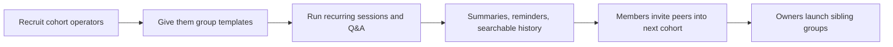

# Cold-Starting Community Products Across Telegram, Discord, LINE OpenChat, Reddit, and Facebook Groups

## Executive Summary

Across the five platforms, successful cold-starts rarely begin with generic social intent. They begin with an **exogenous reason to return**: a creator’s output, a useful information feed, a migrated social graph, or a recurring operational need. The strongest early-stage cases in the evidence base are: high-urgency information and mobilization networks on Telegram; tool-mediated creation around entity["company","Midjourney","ai lab"] on Discord; interest- and identity-based rooms inside LINE OpenChat in entity["country","Taiwan","east asia"] and entity["country","Thailand","southeast asia"]; content-seeded topic communities on Reddit; and hyperlocal reciprocity networks such as the entity["organization","Buy Nothing Project","gift economy network"] on Facebook Groups. In each case, utility or content arrived before dense peer-to-peer conversation. citeturn15view0turn19view5turn19view6turn16view2turn16view3turn16view4turn14view3turn14view4turn22view0turn22view1

The implication for 0→1 community products is straightforward: **social density is an outcome, not a starting asset**. Products that let users consume valuable content before posting, understand norms before speaking, and observe live proof of interaction before inviting others gain traction much faster. Telegram channels, Reddit seed-posting, and LINE OpenChat history all reduce first-post anxiety. Discord succeeds fastest when the product itself generates activity, because the “community” is already wrapped around a tool. Facebook Groups perform best when the group solves a recurring local or product-affinity problem. citeturn20view1turn29search4turn15view2turn14view4turn16view3turn32search12turn22view0turn22view2

Given the user’s “no specific constraint” assumption, the most defensible recommendation for a **new IM product** is to start with **tool-driven need**. The first owners should be operators of recurring, outcome-oriented groups: bootcamp instructors, certification-study mentors, language-exchange hosts, and job-transition coaches running 30–300 person cohorts. They have repeat cadence, clear admin pain, strong reasons to preserve history, and measurable success criteria. Telegram and Discord already win among power users, yet both impose tradeoffs that create room for a new entrant: Telegram’s open graph and anti-spam mechanics can reduce trust for ordinary users, while Discord’s channel-role-onboarding model is powerful yet cognitively heavy and weak in true 0→1 internal discovery. citeturn31view0turn24view1turn24view0turn15view2turn15view4turn15view1

## Method and Evidence Standard

This report privileges four evidence layers, in descending order: **official platform mechanics**, **official platform-hosted case studies**, **peer-reviewed or academically grounded case studies**, and **well-documented secondary materials when official public documentation is thin**. Chinese-language evidence is strongest for LINE OpenChat’s design and adoption in Taiwan; English evidence is strongest for Telegram, Discord, Reddit, and most Facebook Group case material. citeturn16view2turn16view3turn33view0turn20view1turn15view0turn14view3turn22view0

| Evidence tier | What it contributed | Highest-confidence examples |
|---|---|---|
| Official mechanics | Discovery rules, join flows, visibility, moderation, history, feedback affordances | Telegram FAQ and Channels FAQ; Discord onboarding/discovery docs; LINE OpenChat guide and launch post; Reddit growth basics; Meta’s public Facebook app positioning citeturn20view1turn19view0turn29search4turn15view2turn15view4turn16view2turn16view3turn14view3turn14view4turn23view0 |
| Official case studies | Representative success patterns under real usage | Midjourney on Discord; LINE OpenChat in Thailand; Reddit moderator spotlights citeturn15view0turn16view4turn14view0turn14view1turn14view2 |
| Academic / research cases | Why members stayed, reciprocity, interaction structure, movement dynamics | Hong Kong Telegram studies; Buy Nothing Facebook-group study citeturn19view5turn22view0 |
| Secondary cases | Gaps where official public docs were sparse or too high level | Darden’s Peloton community note; Monterail’s Buy Nothing migration case citeturn22view2turn22view1 |

## Platform Analysis

One structural difference matters most in 0→1: whether a platform can deliver value **before** a critical mass of conversation exists. Telegram channels, Reddit-seeded posts, and LINE OpenChat’s searchable/history-preserving rooms support that pattern directly. Discord and Facebook Groups can do it too, though they usually need either a tool, a migrated audience, or a strong off-platform identity anchor. citeturn20view1turn29search4turn14view4turn16view3turn15view0turn22view0

| Platform | Best-documented first cohort source | Why they stayed | When interactions began | Mechanisms that drove expansion | Representative evidence |
|---|---|---|---|---|---|
| Telegram | **Existing community migration** and **KOL/creator broadcast** were strongest in the documented cases. Telegram makes public chats searchable, public channels joinable, and invite-link migration easy. In the best-known evidence, political/media communities in entity["country","Belarus","eastern europe"] and entity["place","Hong Kong","china sar"] used channels as fast information rails. | Members stayed for **timely, high-signal information**, unified history, searchable archives, and discussion anchored to posts. In Hong Kong, users also stayed because hashtags and geolocation enabled spontaneous coordination across semi-autonomous clusters. | Interaction began **after informational value was already clear**. Channel-first patterns often start with read-only consumption, then shift to comments, reactions, polls, or linked discussion groups once a trusted feed exists. | Expansion came from **public usernames, search, invite links, forwarding, QR/shareability, and channel→discussion-group coupling**. This favors narrow, high-frequency feeds with adjacent discussion, rather than blank groups. | Telegram supports public groups, persistent history, usernames, and invite-link migration. Channels can add linked discussion groups, comments, reactions, and polls. Anti-ELAB research found subscription networks plus hashtags/geolocation were central to mobilization; NEXTA Live scaled from roughly 300k to 2M followers in the first weeks of the 2020 Belarus protests. citeturn20view1turn19view0turn29search4turn19view2turn19view5turn19view6turn19view4 |
| Discord | **Tool-driven need** is the clearest standout. The best cold-start case is entity["company","Midjourney","ai lab"], which began with a small invite-only beta of AI enthusiasts already comfortable on Discord. | Users stayed because **the tool itself generated value and visible artifacts**. Every `/imagine` call made the product useful and social at once; collaborative creation spaces and iterative feedback kept the loop tight. | Interaction began **on day zero**, because using the product produced public outputs in shared channels. Discord works best when usage itself emits conversation, screenshots, critique, or status. | Early growth depended on **invite-only scarcity, off-platform buzz, and Discord-native collaboration**, more than internal discovery. This matters because Server Discovery only unlocks after meaningful scale and maturity thresholds. | Discord’s Midjourney case says the team chose Discord after user tests showed AI enthusiasts preferred it; the server started invite-only and hit the prior 1M-server cap within three months of private testing. Discord’s official docs also show why 0→1 is hard without an external loop: Discovery requires at least 1,000 members, 8 weeks of age, and activity thresholds; onboarding can require multiple channel/role decisions up front. citeturn15view0turn15view4turn15view2turn15view1turn27search0 |
| LINE OpenChat | The strongest patterns are **external content / interest funnel** and **KOL-fandom / identity communities inside the existing LINE graph**. Official materials emphasize hobbies, fandom, school, shopping, travel, news, and interest-based matching. | Members stayed for a combination of **privacy-preserving custom nicknames**, large room capacity, admin controls, visible history for late joiners, and topic-level threading. This reduces the cost of joining a room where others already know each other. | Interaction begins **earlier than in blank-group products** because new members can enter through interest search or invitation and still browse prior context. Threading further lowers the “where do I speak?” problem. | Expansion comes from **public join settings, password or approval gates, internal LINE familiarity, topic/interest matching, and region-scale distribution inside LINE’s existing communication supergraph**. | Official Taiwanese materials position OpenChat as topic-based communities with custom nicknames, up to 5,000 members, three join modes, and six months of visible chat history for new joiners. LY Corporation’s Thailand case says users join anonymously around attributes and interests; a 2025 Taiwan media guide says motivations center on matching interests/needs and accessing information, with more than 450,000 communities created and nearly 20 million active users in Taiwan in 2023. OpenChat is region-limited to Japan, Taiwan, and Thailand. citeturn16view3turn16view2turn16view4turn33view0turn17view3turn18search14turn32search12 |
| Reddit | **External content funnel** and **latent-topic gap filling** dominate. New communities work when moderators seed enough content that a visitor can immediately understand the topic and safely pile on. | Members stayed for **clear mission, visible norms, and enough content to interact with right away**. In professional communities, staying power came from peer problem-solving and culture that resisted spam or commercial capture. | Interaction began **only after seeding**. Reddit’s own help docs explicitly argue against “if I build it, they will come,” recommending day-one content deep enough that a visitor has to scroll to see it all. | Expansion is driven by **crossposts, related-community mentions, precise topic labeling, mod-to-mod collaboration, and internal recommendation via topics**. Discovery is content-led, not chat-led. | Reddit’s official growth docs recommend seeding content before promotion, organic mentions, crossposting, and welcome flows. In moderator stories, r/NotFoolingAnybody began by posting relevant content plus promotion in related subreddits; r/sysadmin solidified around professional discourse and grew quickly once mission and culture were clear. Community topics also help Reddit connect new communities with relevant audiences faster. citeturn14view4turn14view3turn14view2turn14view0turn5search4 |
| Facebook Groups | The most durable starts are **existing community migration** and **tool-driven local/product need**. Evidence is strongest for hyperlocal gifting and product-affinity groups. | Members stayed for **practical exchange, advice, reciprocity, and identity reinforcement**. In gifting groups, interaction structure is denser and more reciprocal than comparable groups; in product-affinity communities, group participation reinforces product use. | Interaction begins **as soon as concrete asks/offers/support posts appear**. These groups do not need sophisticated social rituals first; the task itself is the icebreaker. | Expansion is driven by **embedded identity graph, local relevance, brand or creator prompts, and visible utility in-feed**. For local groups, neighborhood relevance is the hook. For product groups, the product journey continuously regenerates topics. | Meta’s public app description presents Groups as places to “learn tips from real people who’ve been there, done that.” The Buy Nothing study found lower friendship density, higher reciprocity, and larger strongly connected components than matched Facebook groups; Monterail’s case says Buy Nothing became popular on Facebook with at least 5.33M users across about 7,000 groups. Darden’s Peloton case notes that users are prompted to join affinity groups and that this community connection increases engagement frequency. citeturn23view0turn22view0turn22view1turn22view2 |

## Source-Type Classification

All four first-cohort source types can work. Their strength varies by platform.

| Platform | Dominant source types | Viable secondary source types | Weakly documented source types |
|---|---|---|---|
| Telegram | Existing community migration; KOL/creator | External content funnel; tool-driven need via bots/utilities | Pure blank-group socializing |
| Discord | Tool-driven need | KOL/creator; existing community migration | External-content-only communities without live utility |
| LINE OpenChat | External content / interest funnel; KOL/fandom | Existing community migration | Pure tool-driven need |
| Reddit | External content funnel; latent-interest or professional migration | KOL/AMA-style activation | Tool-driven need as primary cold-start |
| Facebook Groups | Existing community migration; tool-driven local/product need | KOL/creator via brand affinity | Pure anonymous interest clustering |

This classification synthesizes the official mechanics and case evidence above. Telegram structurally favors linked broadcast-plus-discussion; Discord favors utility-wrapped communities; LINE OpenChat favors interest/identity discovery inside LINE’s installed base; Reddit favors seeded content and adjacent-community routing; Facebook Groups favor tasks that benefit from existing identity and trust scaffolding. citeturn20view1turn29search4turn15view0turn15view4turn16view3turn16view4turn14view3turn14view4turn22view0turn23view0

## Cross-Platform Conclusions

The evidence supports five necessary conditions for cold-start success.

First, **the product must answer “why come back tomorrow?” before it asks “who will talk to whom?”**. Telegram’s best-documented large-scale wins are urgent information networks; Midjourney succeeded because creating images was intrinsically rewarding; Buy Nothing worked because neighbors had real items to exchange. Communities that launch around vague belonging tend to stall. citeturn19view5turn19view6turn15view0turn22view0

Second, **the room must feel alive before new members are asked to contribute**. Reddit explicitly recommends seeding enough content that visitors must scroll; LINE OpenChat lets new users view prior context; Telegram groups can preserve history for joiners. These all reduce the social risk of being “the first person talking into an empty room.” citeturn14view4turn16view3turn20view1

Third, **interaction should start at the narrowest useful unit**. Telegram channels use post comments or linked discussion groups; Discord uses specific channels and role-based access; LINE OpenChat adds threads; Reddit anchors on posts and comments. Communities grow faster when the initial interaction surface is constrained and legible. citeturn29search4turn15view2turn16view2turn14view4

Fourth, **moderation and norm-setting are part of the cold-start product, not later hygiene**. Reddit’s official materials and moderator stories emphasize mission clarity, seeded examples, welcome messaging, Automod, and anti-spam posture. LINE OpenChat’s admin settings and AI spam filtering, Telegram’s granular admin privileges, and Discord’s community-server tooling make the same point in different ways: unmanaged early growth degrades trust and suppresses future participation. citeturn14view3turn14view0turn14view1turn16view2turn16view3turn20view1turn15view1

Fifth, **the earliest growth loop should be artifact-led, not invite-led**. On Discord, each generated image could recruit observers. On Telegram, each timely post could be forwarded. On Reddit, each seeded post could be crossposted or discovered. On Facebook Groups, each successful exchange or advice thread created proof of value. Invite links matter, though they compound much better when tied to visible outcomes. citeturn15view0turn20view1turn14view3turn22view0

The diagram summarizes the common cold-start loop supported across the five platforms: utility/content first, interaction second, broad discovery later. Telegram, Reddit, and LINE OpenChat support the first two steps directly; Discord and Facebook Groups do so when a tool or task supplies the initial energy. citeturn20view1turn15view4turn14view4turn16view3turn22view0

## Recommendation for a New IM Product

If I had to pick **one** first-cohort type for a new IM product, I would pick **tool-driven need**.

More specifically, I would recruit **cohort-based learning operators** as the first group owners: exam-prep mentors, language-exchange hosts, bootcamp instructors, course TAs, and job-transition coaches running recurring cohorts of roughly 30–300 members. This group has an unusually favorable mix of properties: they already create scheduled interaction, they need structured history, they benefit from role-light moderation, and they can measure success through attendance, completions, placements, and retention. Their groups are also socially valuable without requiring celebrity status or massive existing fan bases. citeturn15view0turn14view4turn16view3turn22view0

The product design should therefore start from **operational primitives** rather than generic social primitives: reusable room templates, owner-defined participant roles, persistent searchable history, thread-level follow/unfollow, event reminders, lightweight summaries, and owner analytics showing silent-member conversion, question resolution time, and cohort completion health. Discord proves that rich structure can support huge communities, though its structure is heavy for many mainstream users. Telegram proves that speed and openness help scale, though openness also creates trust and spam tradeoffs. A new IM entrant should keep the operational value while compressing the cognitive burden. citeturn15view2turn15view1turn15view4turn31view0turn20view1

Users may avoid Telegram for three concrete reasons. **Trust** is one: Telegram’s own FAQ says strangers can find and contact users via shared groups or public usernames, and its spam FAQ exists because unwanted outreach and group/channel invites are common enough to trigger report-and-limit systems. **Conversation architecture** is another: the strongest Telegram pattern is often channel-first with linked discussion, which is efficient for broadcast-led communities and less natural for ordinary relationship-first groups. **Perceived signal quality** is a third: when discovery relies heavily on invite links, usernames, forwards, and external indexes, users often need strong prior intent to join. citeturn24view1turn24view2turn31view0turn20view1turn29search4

Users may avoid Discord for equally concrete reasons. **Cognitive load** is the main one: Discord’s official onboarding flow asks admins to define default channels, questions, roles, and channel assignments, and its discovery layer does not activate until a server already has at least 1,000 members plus age and activity requirements. That makes Discord excellent for power communities, hobbyist depth, and tool-centric ecosystems, yet suboptimal for lightweight, mainstream, mobile-first group messaging. Many users want “open app, see thread, reply” rather than “join server, parse channel taxonomy, pick roles, learn norms, then speak.” citeturn15view2turn15view4turn15view1

My direct recommendation is therefore: **build the first version for cohort operators, not for creators, fandoms, or generic friend groups**. It is the cleanest wedge because it creates daily usage from work that already exists.

This wedge minimizes cold-start risk because the owner already has a reason to organize, the members already have a reason to return, and the product can prove value with operational metrics long before it needs broad social discovery. citeturn15view0turn14view4turn22view0

## Testable Hypotheses

The hypotheses below are designed for a new IM product using the recommendation above.

| Priority | Hypothesis | Verification method | Success signal | Fail signal |
|---|---|---|---|---|
| High | Tool-driven cohorts will retain owners better than creator-led chat groups in the first 30 days. | Run a matched pilot: 20 cohort operators vs. 20 creator-led communities. Track D30 owner retention and weekly active owners. | D30 owner retention at least 20 percentage points higher in tool-driven cohorts. | Gap under 10 points. |
| High | Groups with **pre-seeded history** will activate new members faster than blank groups. | A/B test empty rooms vs. rooms preloaded with summary, FAQ, and 10 example threads/messages. | First-session reply rate and D7 retention both improve by 15%+. | No meaningful lift. |
| High | A **single default discussion surface plus optional threads** will outperform multi-room navigation for mainstream cohorts. | A/B test one-main-room-plus-threads vs. five-channel template. | Higher reply depth, lower bounce after join, lower “confused/new-user help” events. | More overload complaints or lower participation. |
| High | Allowing owners to import or mirror external materials will reduce cold-start time. | Test calendar / syllabus / notion-doc / CSV import on owner setup flow. Measure time-to-first-useful-session. | Median time from group creation to first meaningful activity falls below 24 hours. | Owners still spend most setup time manually reconstructing context. |
| Medium | Lightweight summaries after each event or active period will improve silent-member conversion. | Turn AI or manual summary cards on for half the groups. Measure next-session reactivation of lurkers. | Silent-member conversion improves 10%+. | No change or higher mute rates. |
| Medium | Role-light moderation will outperform heavy role-gating in early-stage cohorts. | Compare open-posting groups with simple owner moderation vs. role-gated speaking permissions. | Higher first-week participation with acceptable abuse rate. | Higher abuse/spam overwhelms owner time. |
| Medium | Referral loops work best when tied to **next scheduled utility**, not generic invites. | Compare invite prompts after “useful event completed” vs. static invite button. | Invite acceptance and new-member activation both improve. | Invite volumes rise without activation lift. |
| Medium | Owners will create sibling groups only after they see cohort analytics that map to outcomes. | Expose owner dashboards for attendance, unresolved questions, and completion risk. Track new-group creation. | Higher owner expansion rate and lower churn among power owners. | Analytics are viewed but do not change behavior. |
| Lower | Cross-group identity portability will matter for cohort operators more than deep profile customization. | Interview + experiment: reusable participant cards vs. extensive profile design. | Higher rejoin rate across successive cohorts. | Little usage of portable identity tools. |

## Open Questions and Limitations

The platform-level conclusions are high confidence. A few sub-areas remain less complete.

The **Telegram** case evidence in English is skewed toward political/media mobilization, especially around entity["organization","NEXTA Live","belarus media channel"] and Hong Kong protest networks. Those cases are still analytically useful because they expose Telegram’s strongest cold-start affordances under stress, though hobby or lifestyle communities may grow more slowly and rely more on creator or niche content loops. citeturn19view5turn19view6turn19view4

For **Facebook Groups**, the best public evidence available without login leaned more on Meta’s public app description, academic analysis of Buy Nothing groups, and external case material such as adaptation work around Buy Nothing and community reinforcement around entity["company","Peloton","fitness company"]. The high-level strategic conclusions are still solid: Facebook Groups are strongest when identity, locality, or recurring product need already exist. citeturn23view0turn22view0turn22view1turn22view2

For **LINE OpenChat**, the conclusions are region-specific by design. Official help and product materials indicate OpenChat is available only in Japan, Taiwan, and Thailand, so its cold-start mechanics cannot be assumed to generalize globally without separate market checks. citeturn17view3turn18search14turn16view4turn33view0